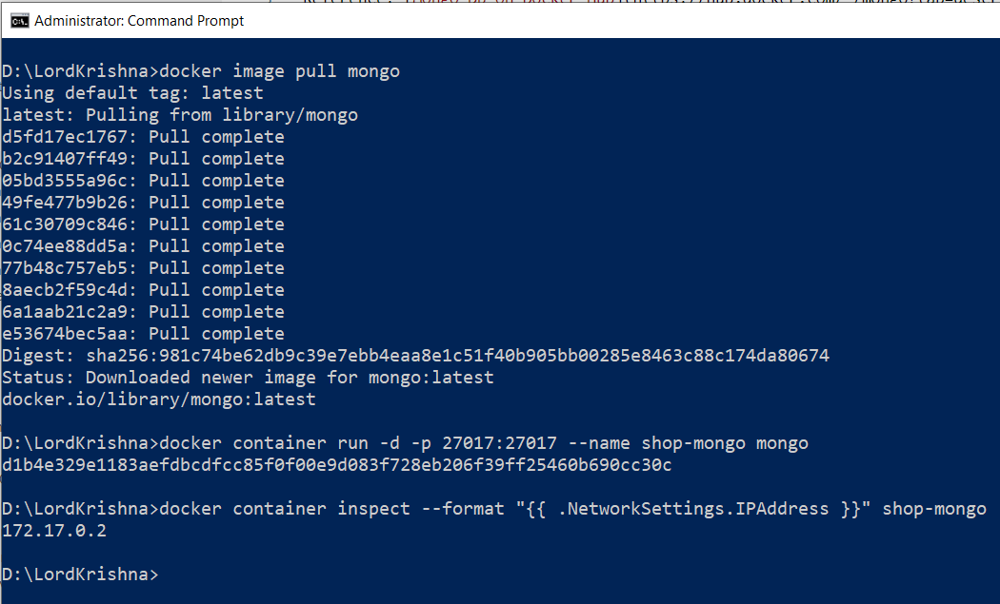
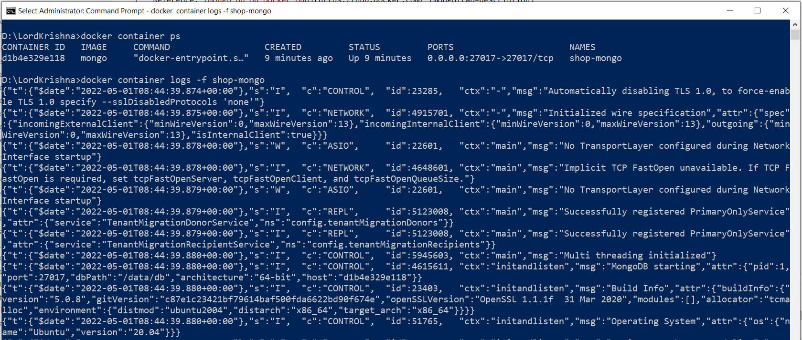
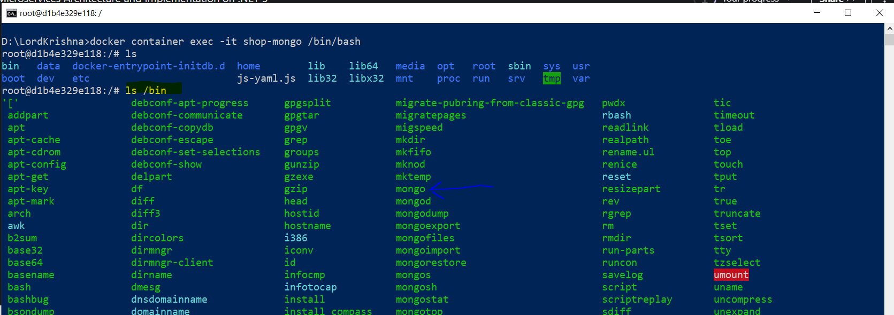
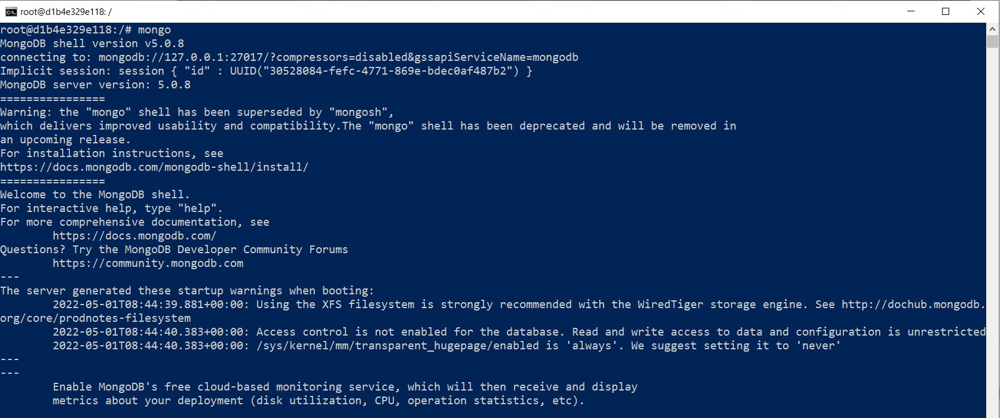
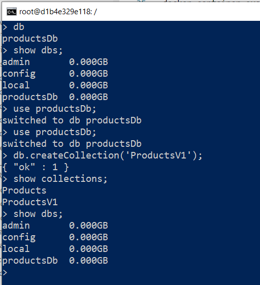
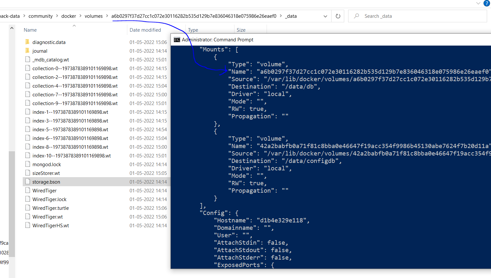
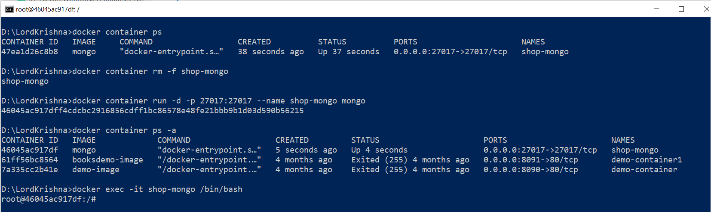

# Docker Commands for creating MongoDB Docker Container

Reference: [Mongo Db on Docker Hub](https://hub.docker.com/_/mongo?tab=description)

## Retrieving the Docker Image and Creating the Container

```
docker image pull mongo
docker container run -d -p 27017:27017 --name shop-mongo mongo
docker sbom mongo
```

## Verify the IP Address of the Container

```
docker container inspect --format '{{ .NetworkSettings.IPAddress }}' <ContainerNameORId>

//WINDOWS ONLY
docker container inspect --format "{{ .NetworkSettings.IPAddress }}" <ContainerNameORId>
```



## Verify the Container is executing, its logs

```
docker container ps
docker container ps -a
docker container ps -q
docker container logs -f shop-mongo
```



## Entering into the Mongo Db Container

```
docker container exec -it shop-mongo /bin/bash
```



## Introduction to Mongo CLI

Reference: [MongoDb CLI](https://www.mongodb.com/docs/v4.4/mongo/)

```
mongo
db
show dbs
show databases
show collections
```



## Creating a Database and Collection

Note: **productsDb** CamelCase is the name of the database.

```
use productsDb;
db.createCollection('Products');
```





## Delete existing Container and re-create

> 1. In this demo, we will delete the existing container and re-create it
> 1. Also, the previously create database and collection will be deleted
> 1. Execute `mongo` command and verify the `Products` is unavailable

```
docker container rm -f shop-mongo
docker container run -d -p 27017:27017 --name shop-mongo mongo
docker container ps -a
docker exec -it shop-mongo /bin/bash
```



## Creating Mongo Db Container with Volumes

```
docker container run -d -p 27017:27017 --name shop-mongo -v /var/lib/docker/volumes/mongo-db-persistance-store/_data:/data/db -v /var/lib/docker/volumes/mongo-db-config-store/_data:/data/configdb mongo
```

## Creating Mongo Db Container with Volumes

```
db.Products.insertMany([{ 'Name':'Laptop 1','Category':'Computers', 'Summary':'Summary', 'Description':'Description', 'ImageFile':'ImageFile', 'Price':54.93 }, { 'Name':'HP Laptop','Category':'Computers', 'Summary':'Summary', 'Description':'Description', 'ImageFile':'ImageFile', 'Price':88.93 } ])

db.Products.find({}).pretty()

db.Products.remove({})
```


