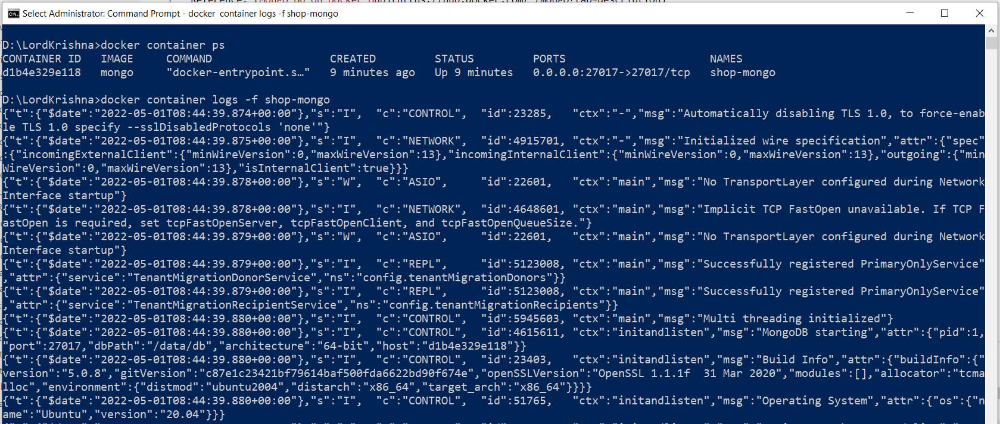
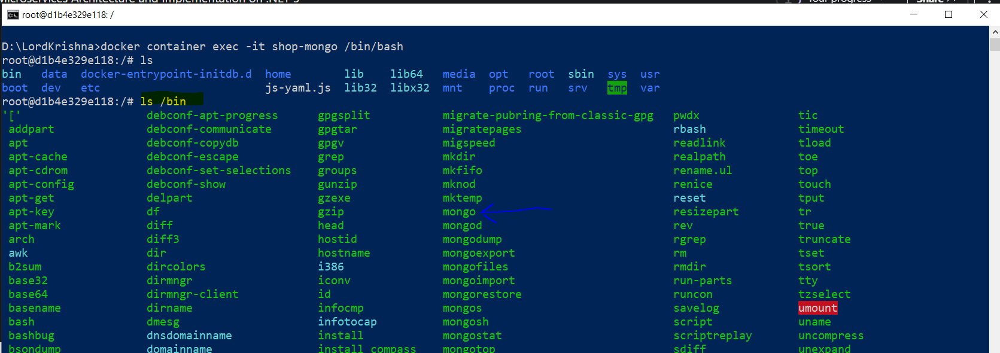
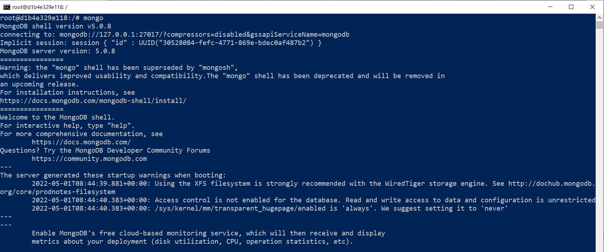
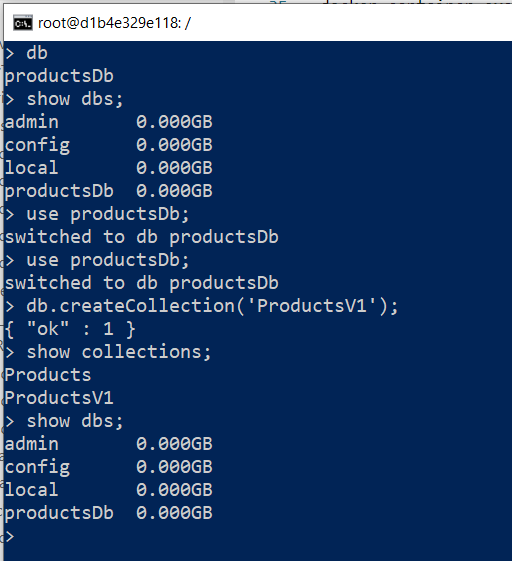
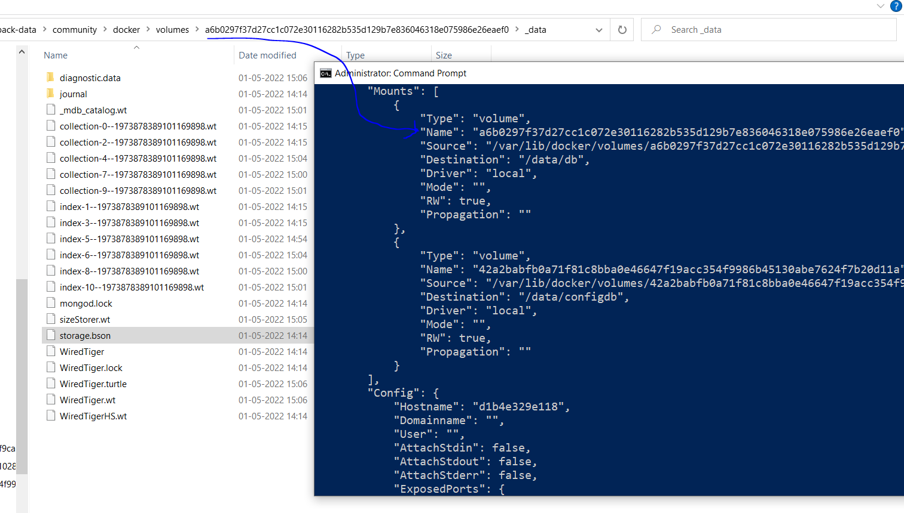
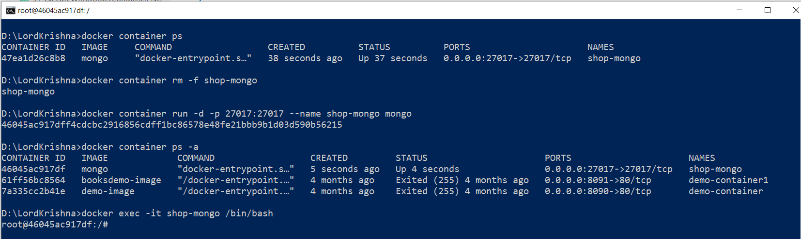

# Docker Commands for creating MongoDB Docker Container

Reference: [Mongo Db on Docker Hub](https://hub.docker.com/_/mongo?tab=description)

## Retrieving the Docker Image and Creating the Container

```
docker image pull mongo
docker container run -d -p 27017:27017 --name shop-mongo mongo
```

## Verify the IP Address of the Container

```
docker container inspect --format '{{ .NetworkSettings.IPAddress }}' <ContainerNameORId>

//WINDOWS ONLY
docker container inspect --format "{{ .NetworkSettings.IPAddress }}" <ContainerNameORId>
```


## Verify the Container is executing, its logs

```
docker container ps
docker container logs -f shop-mongo
```



## Entering into the Mongo Db Container

```
docker container exec -it shop-mongo /bin/bash
```



## Introduction to Mongo CLI

Reference: [MongoDb CLI](https://www.mongodb.com/docs/v4.4/mongo/)

```
mongo
db
show dbs
```



## Creating a Database and Collection

```
use productsDb;
db.createCollection('Products');
```





## Delete existing Container and re-create

> 1. In this demo, we will delete the existing container and re-create it.
> 1. Also, the previously create database and collection will be deleted.

```
docker container rm -f shop-mongo
docker container run -d -p 27017:27017 --name shop-mongo mongo
docker container ps -a
docker exec -it shop-mongo /bin/bash
```



