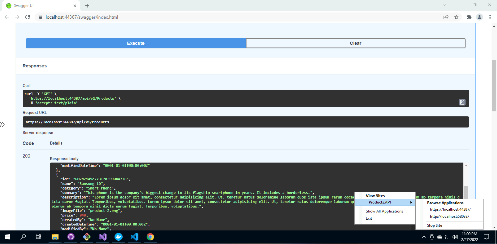
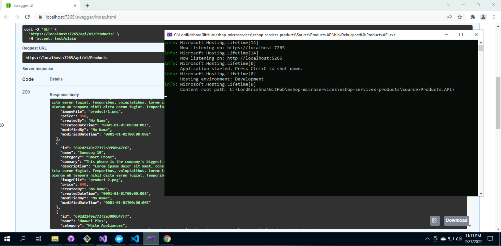
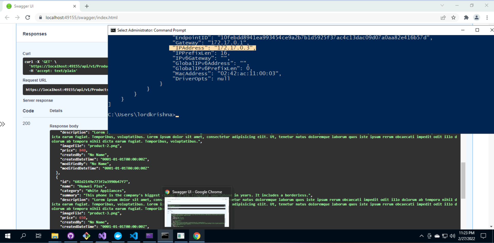
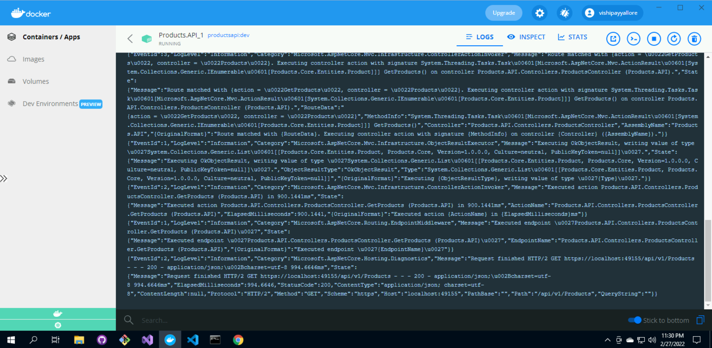
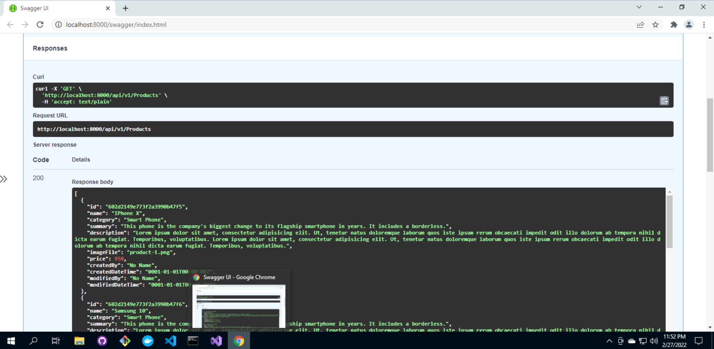

# Session 1

## Docker Desktop

> 1. Demo and Discussion

## Mongo Db

> 1. Mongo Atlas
> 1. MongoDB Community Edition
> 1. MongoDB Docker Container
> 1. Mongo GUI Docker Container

## Current Features in Web API

> 1. Layered Architecture
> 1. Strongly typed Configuration
> 1. Swagger
> 1. appsettings.json, and secrets.json
> 1. Repository Pattern
> 1. Dependency Injection (Demo)

## Dockerfile

> 1. Demo and Discussion

## Local Execution Modes using VS 2022

**Note:** Mongo Db in Atlas and Docker Container

> 1. IIS Express
> 1. Kestrel
> 1. Docker
> 1. Docker Compose

## Review/Q & A/Panel Discussion

> 1. Discussion

## What is next in `Session 2`?

> 1. Discussion
