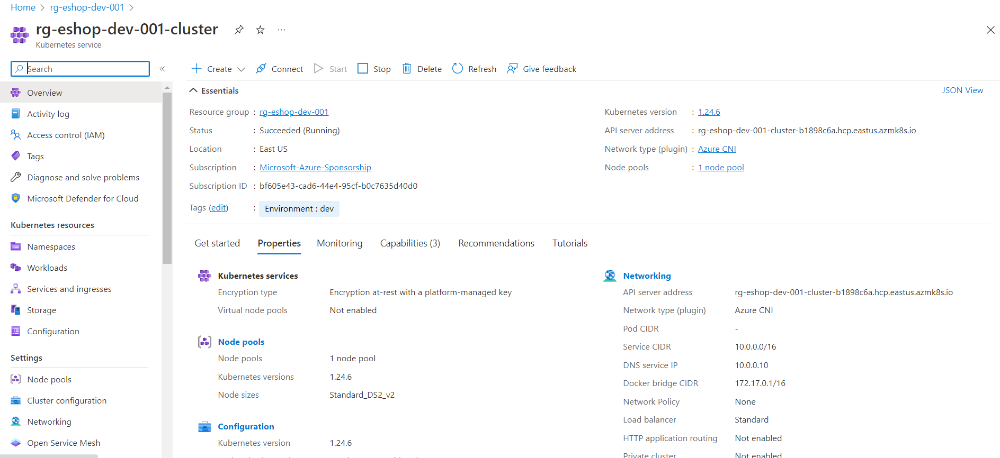
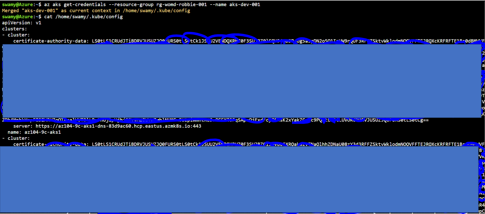
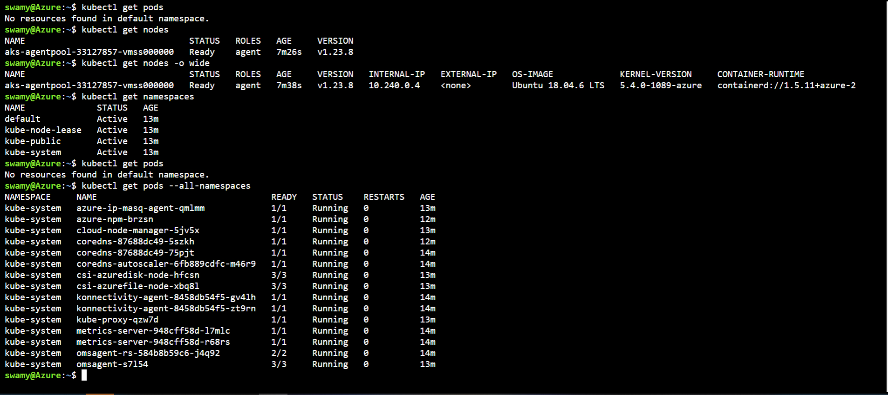

# Session 10

## What are we going to do today?

> 1. Hands on Azure Kubernetes Service using Portal / VS Code Extension  (`10 Minutes`)
>     - Using `Azure Portal` | `VS Code Extension`
> 1. Hands on Azure Kubernetes Service using Imperative way using Azure Cloud Shell (`10 Minutes`)
>     - kubectl get `nodes` | `pods` | `service` | `deployments`
> 1. Recap and Review of Products Microservice (`10 Minutes`)
> 1. CRUD Operations on the Deployed `Products` microservice into AKS using Postman (`5 Minutes`)
> 1. Review/Q & A/Panel Discussion (`5 Minutes`)
> 1. What is next in `Session 11`? (`5 Minutes`)

## 1. Hands on Azure Kubernetes Service using Portal / VS Code Extension (`10 Minutes`)

> 1. Discussion and Demo

### Using `Azure Portal` | `VS Code Extension`

> 1. Discussion and Demo

## 2. Hands on Azure Kubernetes Service using Imperative way using Azure Cloud Shell (`10 Minutes`)

> 1. Discussion and Demo

### kubectl get `nodes` | `pods` | `service` | `deployments`

> 1. Discussion and Demo

### Using `Azure Cloud Shell`

> 1. Discussion and Demo

## 3. Recap and Review of Products Microservice (`10 Minutes`)

> 1. Discussion

## 4. CRUD Operations on the Deployed `Products` microservice into AKS using Postman (`5 Minutes`)

> 1. Discussion and Demo

## 5. Review/Q & A/Panel Discussion (`5 Minutes`)

> 1. Discussion

---

## 6. What is next in `Session 11`? (`5 Minutes`) on `04-Nov-2022`

1. Introduction - (5 Minutes)
1. To be done
1. Review/Q & A/Panel Discussion (`5 Minutes`)
1. What is next in `Session 12`? - (5 Minutes)
