# Session 2

## New Features

> 1. Serilog third-party logger provider
> 1. Postman Collection
> 1. Show casing the existing Unit Tests

**Default Logging**
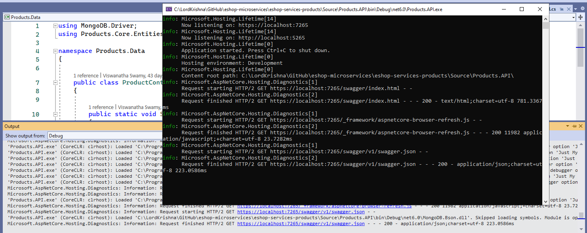

**Serilog Logging**
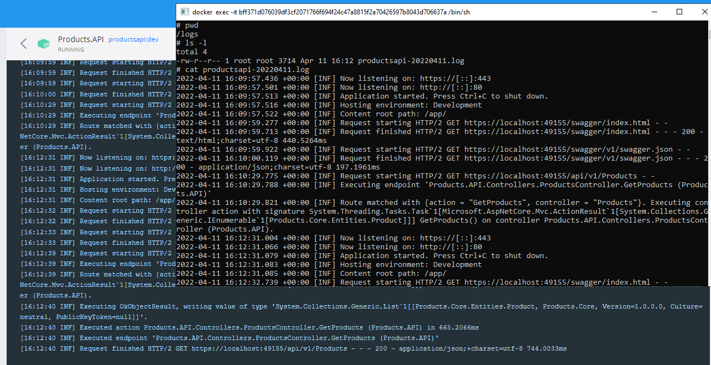

**Postman Collection Local**
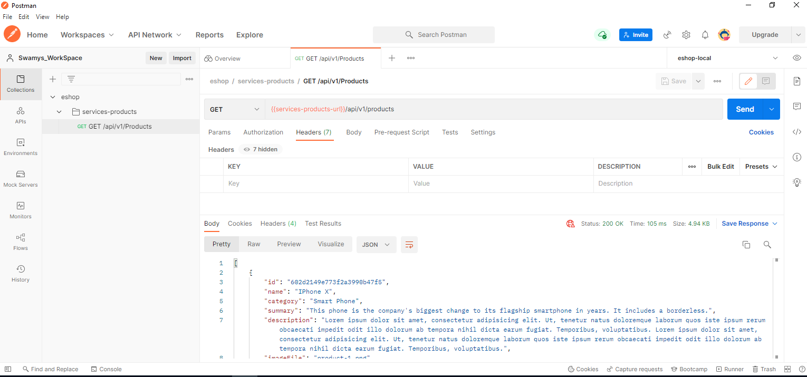

## Executing the solution in `Mac OS 12.3 (build 21E230)` using VS 2022

> 1. Discussion and Demo

## Executing the solution in `Ubuntu 20.04` using VS Code

> 1. Demo and Discussion

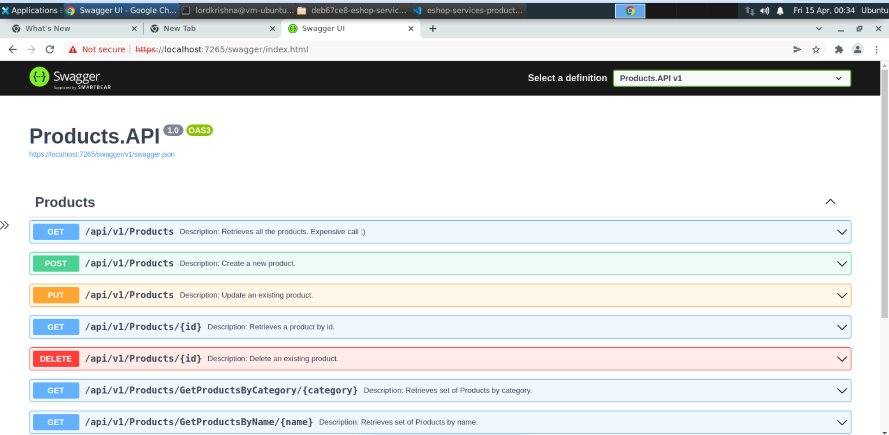


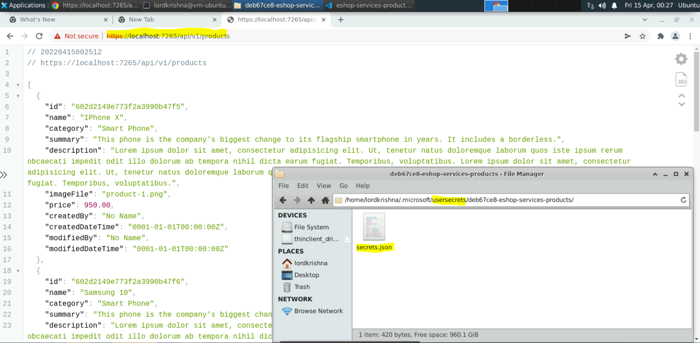

## Shell Scripts

> 1. Demo and Discussion

Please refer the [example.bashrc](./Scripts/example.bashrc) file for the shell script to be executed in the terminal.

```
code ~/.bashrc `Your choice of text editor`
source ~/.bashrc
echo $Environment_Variable_Name
```

## Build And Push Image To Docker Hub

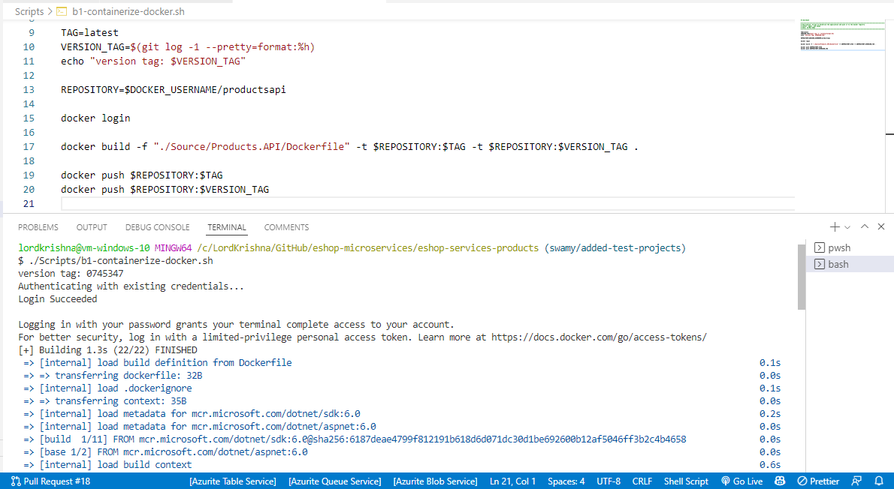

## Deploy Single `Azure Container Instance` from Docker Hub Image

**Note:**

> 1. Enable the Network Access for Mongo Db
> 1. `MongoDbSettings__ConnectionString` should come from `.bashrc`

**Example MongoDb Settings**

```
MongoDbSettings__CollectionName = Products
MongoDbSettings__ConnectionString = mongodb://productsdb:27017
MongoDbSettings__DatabaseName = ProductsDb
```

**ACI Single Container Using Cli from Docker Hub**
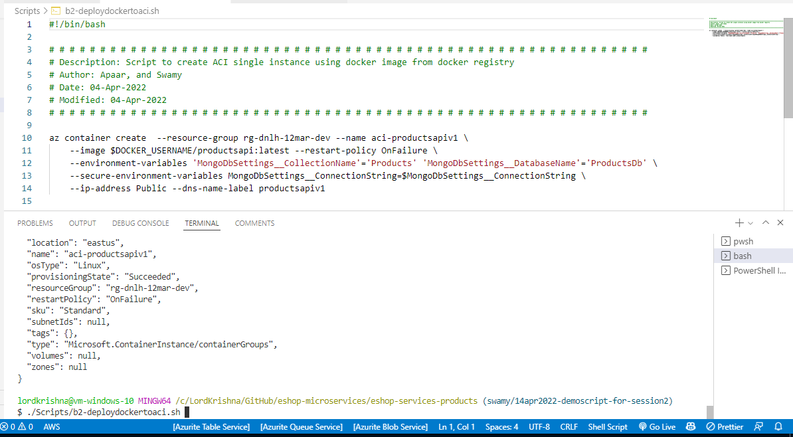

**Accessing the API from ACI Container**
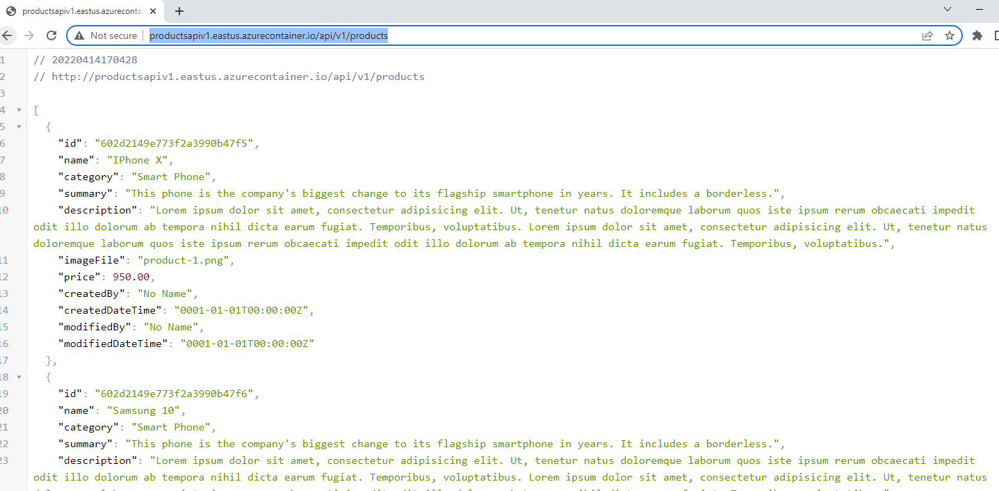

## Creating Azure Container Registry using Azure CLI

> 1. Demo and Discussion

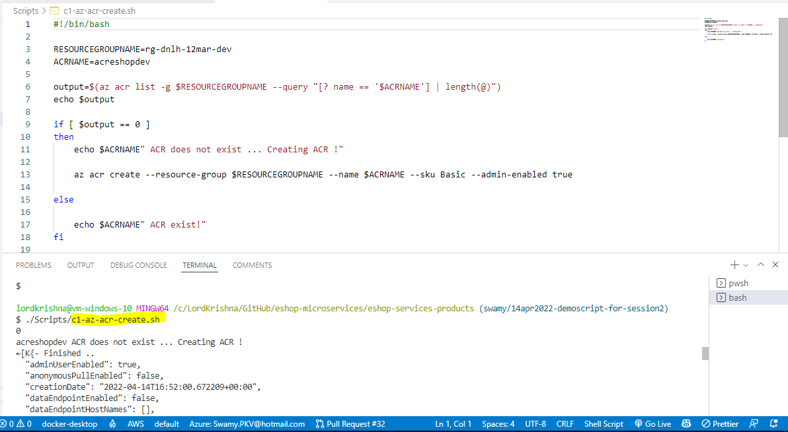

## Build And Push Image To Azure Container Registry

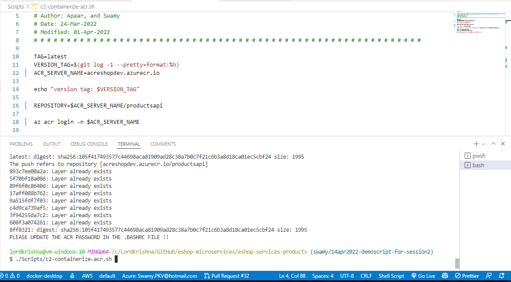

## Deploy Single `Azure Container Instance` from `Azure Container Registry` Image

```
MongoDbSettings__CollectionName = Products
MongoDbSettings__ConnectionString = mongodb://productsdb:27017
MongoDbSettings__DatabaseName = ProductsDb
```

**ACI Single Container Using Cli from ACR**
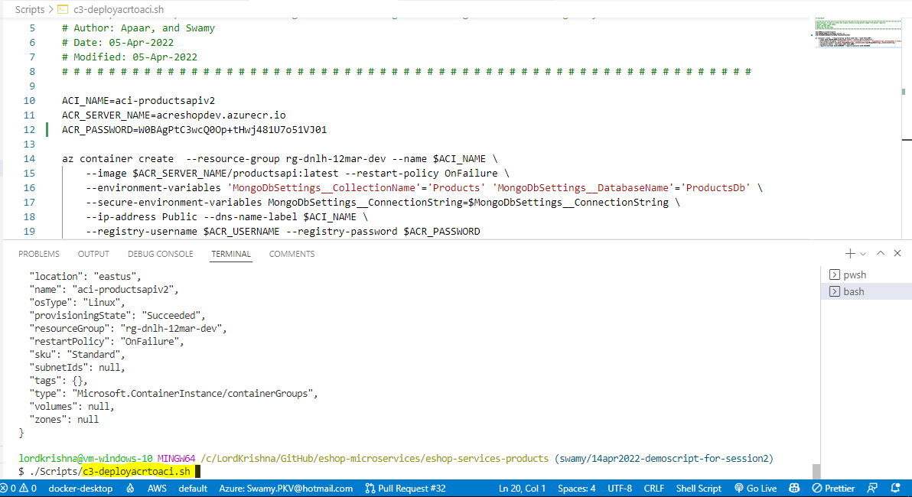

**Accessing the API from ACI Container**
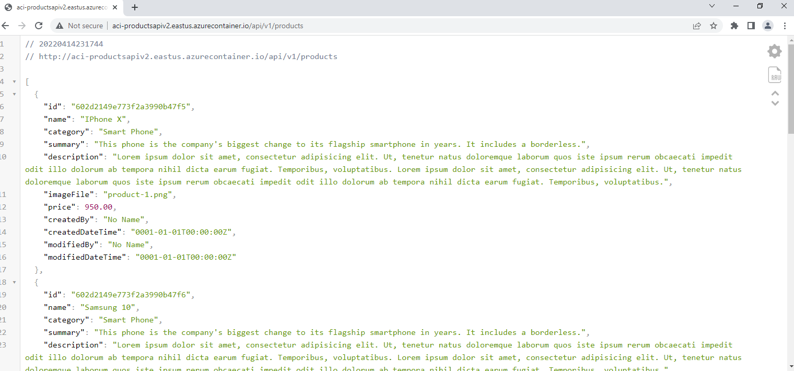

## Using Postman to hit the ACI instance. Environments- [ACI 1, ACI 2]

> 1. Demo & Discussion

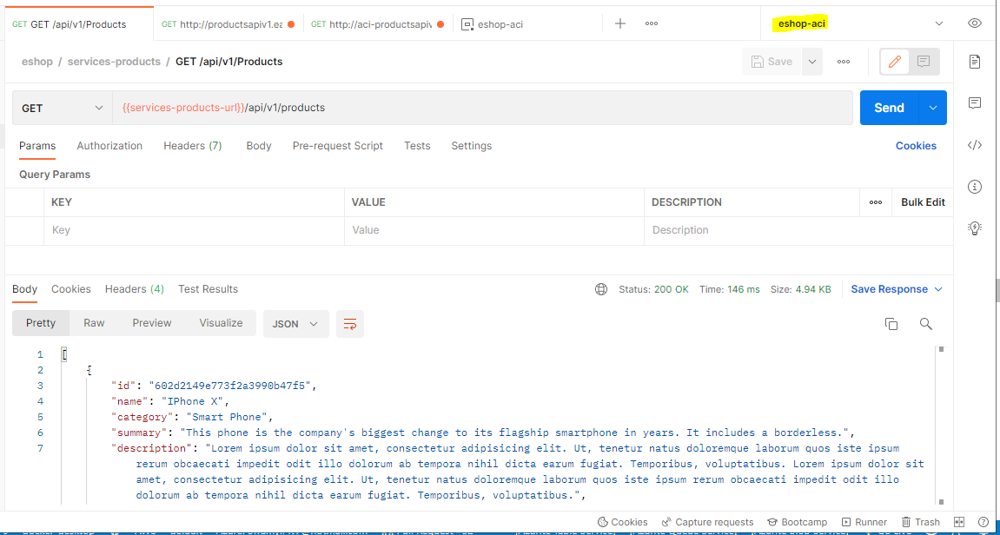

## Review/Q & A/Panel Discussion

> 1. Discussion

## What is next in `Session 3`?

> 1. Discussion