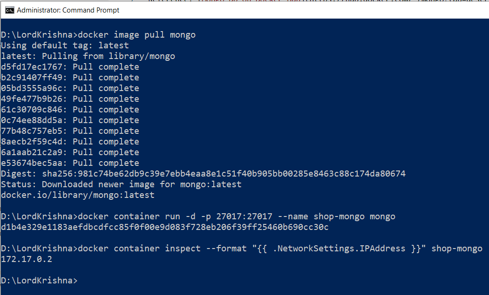
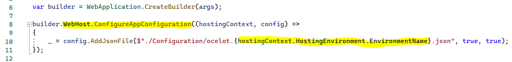
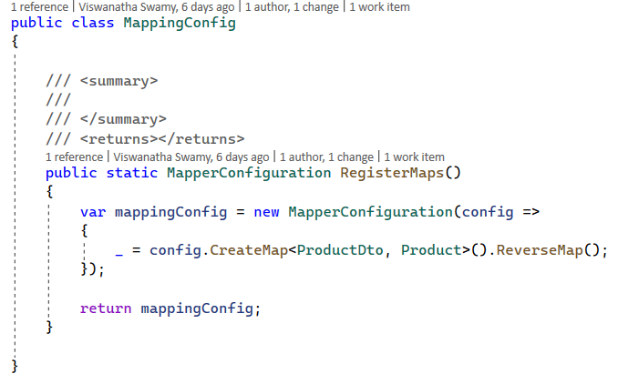
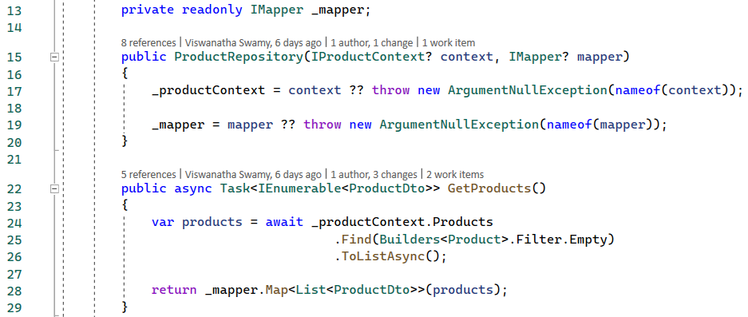
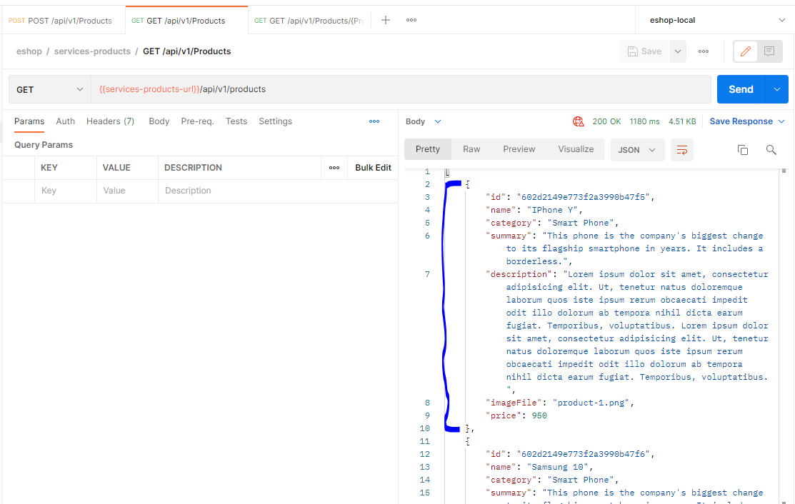

# Session 3

## New Features

> 1. [Docker Commands](./DockerCommandsForMongo.md) for MongoDb Container with Volume Mounts
> 1. Configuring the configuration with a Demo
> 1. Auto Mapper
> 1. Data Transfer Objects for Product

### 1. [Docker Commands](./DockerCommandsForMongo.md) for MongoDb Container with Volume Mounts
> 1. Discussion and Demo

### 2. Configuring the configuration with a Demo
> 1. Discussion and Demo

### 3. Auto Mapper
> 1. Discussion and Demo

### 4. Data Transfer Objects for Product
> 1. Discussion and Demo

## Review/Q & A/Panel Discussion

> 1. Discussion

## What is next in `Session 4`?

> 1. Discussion
