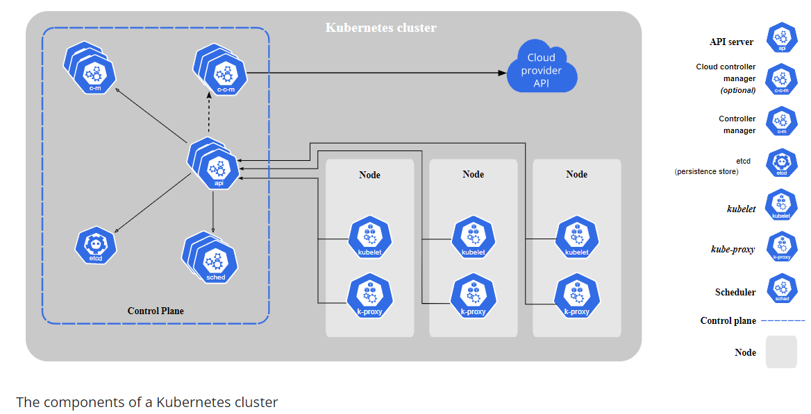
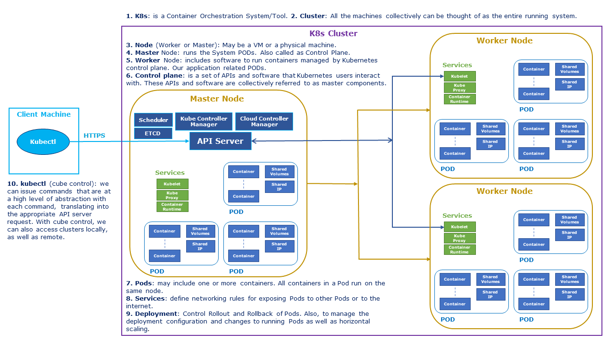
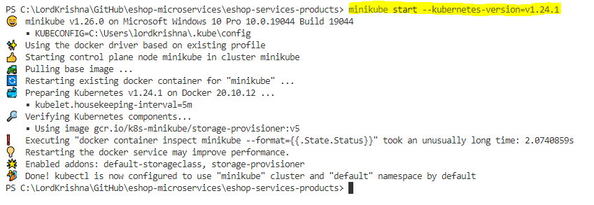
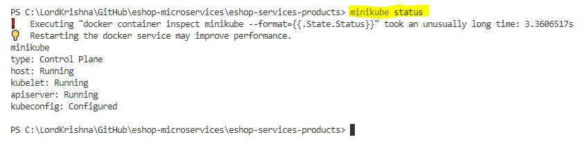
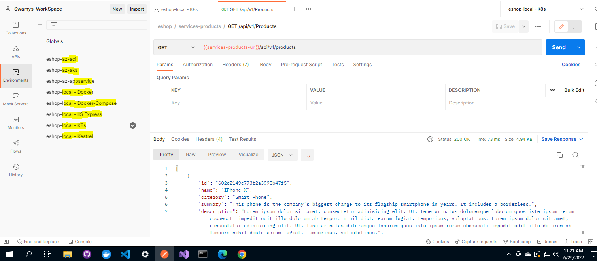

# Session 5

## What are we going to do today?

> 1. Introduction to K8s. What and Why of K8s (`5 Minutes`)
> 1. Hands on K8s & Hands on Minikube locally (`30 Minutes`)
> 1. Deploying `Multi Containers` in **AKS** using **YML** (`10 Minutes`)
> 1. Verify the Deployments using Postman (`10 Minutes`)
> 1. Review/Q & A/Panel Discussion (`3 Minutes`)
> 1. What is next in `Session 6`? (`2 Minutes`)

## Introduction to K8s. What and Why of K8s (`5 Minutes`)

> 1. Discussion and Demo
> 1. K8s container runtime agnostic
> 1. [DC/OS](https://dcos.io/), [Kubernetes](https://kubernetes.io/docs/home/), and [Docker Swarm](https://docs.docker.com/engine/swarm/)
> 1. AKS, EKS, and GKE

---

## Hands on K8s & Hands on Minikube locally (`30 Minutes`)

> 1. Discussion and Demo
> 1. Few of the supported container runtimes - Docker, Containerd, and CRI-O


**Image:** From [Official K8s Documentation](https://kubernetes.io/docs/concepts/overview/components/)

### K8s Terms

> 1. Clusters
> 1. Nodes (Master, and Worker)
> 1. Namespace
> 1. Pods (One or more containers)
> 1. Service
> 1. Deployment
> 1. Replica Set
> 1. kubectl



### Single Node K8s Cluster

> 1. Docker Desktop, minikube, and kubeadm (Linux Machines)

### Multi Node K8s Cluster

> 1. AKS, EKS, GKE, kubespray/kubeadm (Full Control)

### K8s CLI (kubectl)

> 1. Discussion and Demo

```
kubectl cluster-info
```

```
kubectl get nodes
```

```
kubectl get namespaces
```

```
kubectl get pods --namespace=kube-system
```

```
kubectl create -f .\Deploy\eshop-products-api-az-webapp.yml

kubectl apply -f .\Deploy\eshop-products-api-az-webapp.yml

kubectl delete -f .\Deploy\eshop-products-api-az-webapp.yml
```

### Minikube

> 1. Discussion and Demo
> 1. Install Minikube
> 1. Start Minikube
> 1. Stop Minikube
> 1. Minikube dashboard and Accessing the **Minikube** dashboard

References:
[Official Minikube Documentation](https://minikube.sigs.k8s.io/docs/handbook/accessing/)

```
minikube start --driver=docker --kubernetes-version=v1.24.1
```



```
minikube status

docker container inspect minikube --format={{.State.Status}}"
```



```
minikube dashboard
```


```
minikube stop
```


### Accessing the Minikube Dashboard


### Deploying `Multi Containers` in **Minikube** using **YML**

> 1. Discussion and Demo
> 1. Deploying Multi Containers in `Minikube` using `YML`
> 1. Port Forwarding
> 1. Accessing the Products API deployed inside K8s
> 1. `Minikube tunnel` and accessing the Products API deployed inside K8s

**Port Forwarding**


**Accessing the Products API deployed inside K8s**


**Minikube Tunneling**


---

## Deploying `Multi Containers` in **AKS** using **YML** (`10 Minutes`)

**Note:**
Kubernetes and YAML files will be discussed in the next session.

> 1. Kubernetes Cluster has been deployed using Github Actions
> 1. Please refer [eshop-products-api-k8s.yml](../../Deploy/eshop-products-api-k8s.yml) file
> 1. Deployment of Products API Micro Service Multi Containers using `kubectl apply -f` command
> 1. Accessing the Products API from AKS Multi Containers

**Kubernetes Cluster has been deployed using Github Actions**


**Deployment of Products API Micro Service Multi Containers in K8s**


**Accessing the Products API from AKS Multi Containers**


---

## Verify the Deployments using Postman (`10 Minutes`)

> 1. Discussion and Demo

### Verify the end points `locally` (Kestrel, IIS Express, Docker, Docker-Compose, and K8s)

> 1. Discussion and Demo

### Verify the end points from `Azure Container Instances`

> 1. Discussion and Demo

### Verify the end points `Docker Instances from App Service`

> 1. Discussion and Demo

### Verify the end points `Azure Kubernetes Service`

> 1. Discussion and Demo



## Review/Q & A/Panel Discussion

> 1. Discussion

## What is next in `Session 6`?

> 1. Discussion

---

