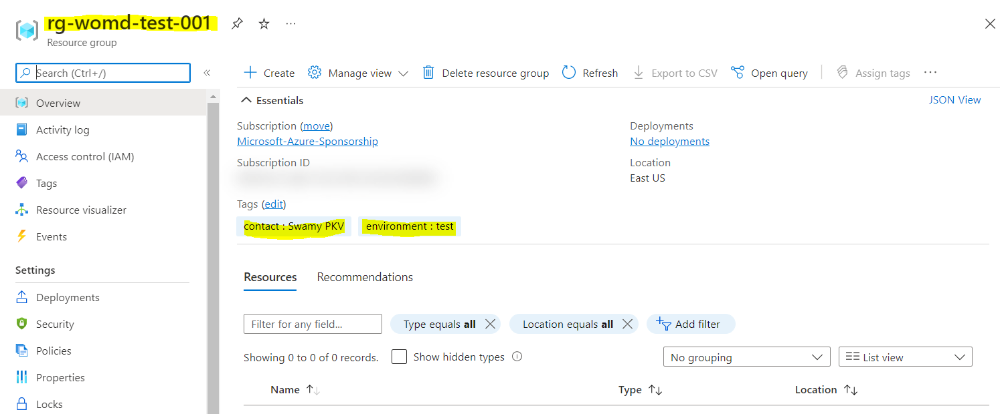
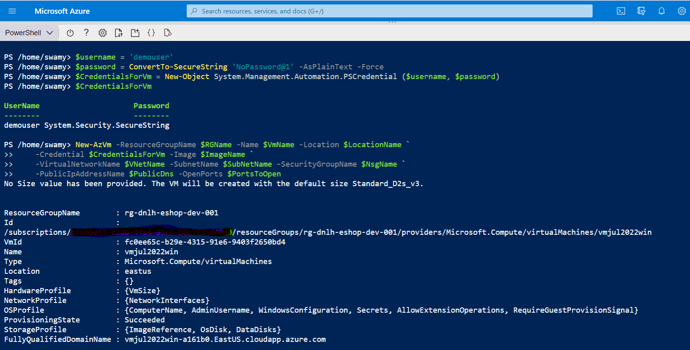
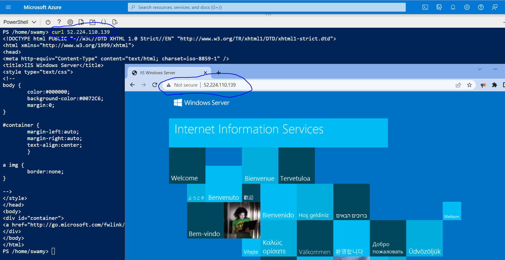
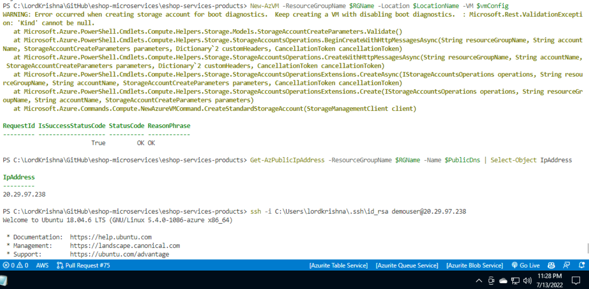
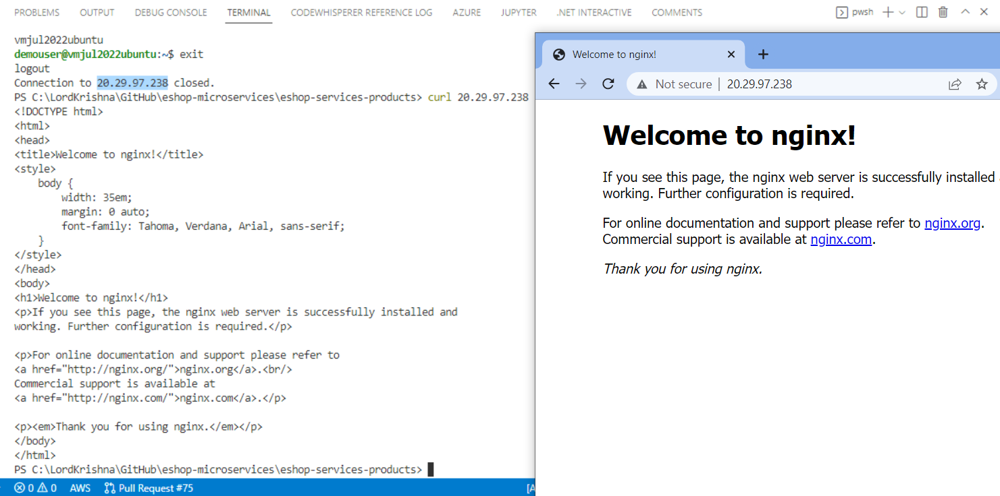
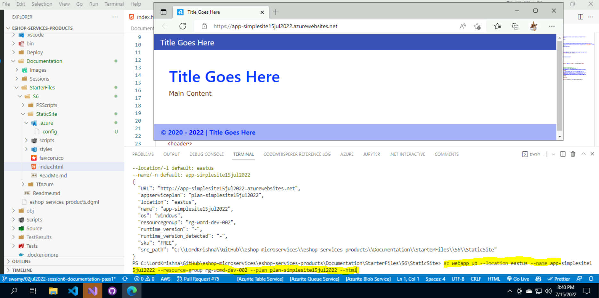
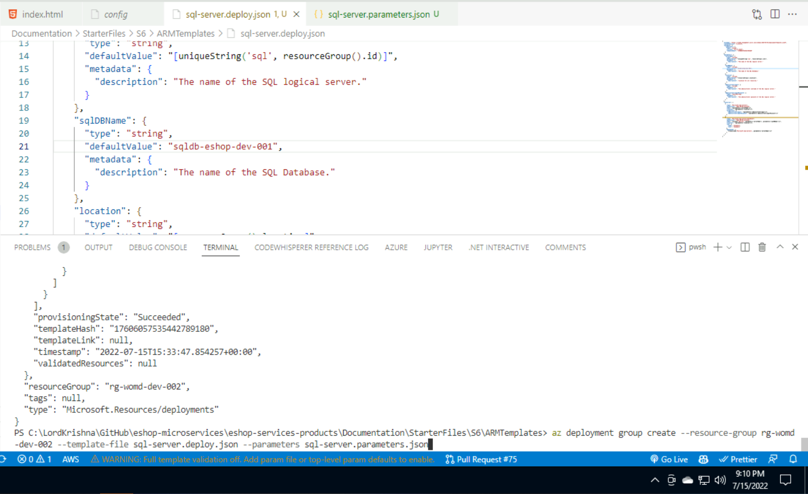

# Session 6

## What are we going to do today?

> 1. Azure Resource Creation - Manual (`3 Minutes`)
> 1. Introduction to PowerShell and Az Module (`3 Minutes`)
> 1. Create a Windows & Ubuntu Virtual Machine in using .PS1 (`4 Minutes`)
> 1. Introduction to `Azure CLI` (`3 Minutes`)
> 1. Create a Web App in using `Azure CLI` (`4 Minutes`)
> 1. What is IaC? (`3 Minutes`)
> 1. Introduction to ARM (`5 Minutes`)
> 1. Deploy SQL Server, Database using ARM, and Azure CLI (`5 Minutes`)
> 1. Deplopy App Service, Web App using ARM, and Azure CLI (`5 Minutes`)
> 1. Review/Q & A/Panel Discussion (`5 Minutes`)
> 1. What is next in `Session 7`? (`5 Minutes`)

## Azure Resource Creation - Manual (`3 Minutes`)

> 1. Discussion and Demo
> 1. Azure Resource Group Creation - Manual
> 1. Add couple of Tags to the Resource Group - Manual



## Introduction to PowerShell and Az Module (`3 Minutes`)

> 1. Discussion and Demo

## Create a Windows & Ubuntu Virtual Machine in using .PS1 (`4 Minutes`)

> 1. Discussion and Demo
> 1. Search [AzVMImage](./Documentation/StarterFiles/S6/PSScripts/SearchVms.ps1)
> 1. Creating [Windows VM](./Documentation/StarterFiles/S6/PSScripts/CreateVmWindows.ps1)
> 1. Creating [Ubuntu VM](./Documentation/StarterFiles/S6/PSScripts/CreateVmUbuntu.ps1)

**Windows VM using PowerShell**




**Ubuntu VM using PowerShell**




## Introduction to `Azure CLI` (`3 Minutes`)

> 1. Discussion and Demo

```AzureCLI
az login
az account list
az account list-locations -o table
```

## Create a Web App in using `Azure CLI` (`4 Minutes`)

> 1. Discussion and Demo

```
az appservice plan create --name plan-simplesite15jul2022 --resource-group rg-womd-dev-002 --location eastus --sku B1

az webapp up --location eastus --name app-simplesite15jul2022 --resource-group rg-womd-dev-002 --plan plan-simplesite15jul2022 --html
```



## What is IaC? (`3 Minutes`)

> 1. Discussion and Demo
> 1. `Provisioning Tools` Azure Resource Manager (ARM), Terraform (TF), and Cloud Formation (CF)
> 1. Configuration Management, and Server Templating tools

**Reference:** [What is infrastructure as code](https://docs.microsoft.com/en-us/devops/deliver/what-is-infrastructure-as-code)

## Introduction to ARM (`5 Minutes`)

> 1. Discussion and Demo

## Deploy SQL Server, Database using ARM + AZ (`5 Minutes`)

> 1. Discussion and Demo

```
az deployment group create --resource-group rg-womd-dev-002 --template-file sql-server.deploy.json --parameters sql-server.parameters.json
```



## Deplopy App Service, Web App using ARM + AZ CLI (`5 Minutes`)

> 1. Discussion and Demo

## Review/Q & A/Panel Discussion

> 1. Discussion

## What is next in `Session 7`?

> 1. Discussion

---
