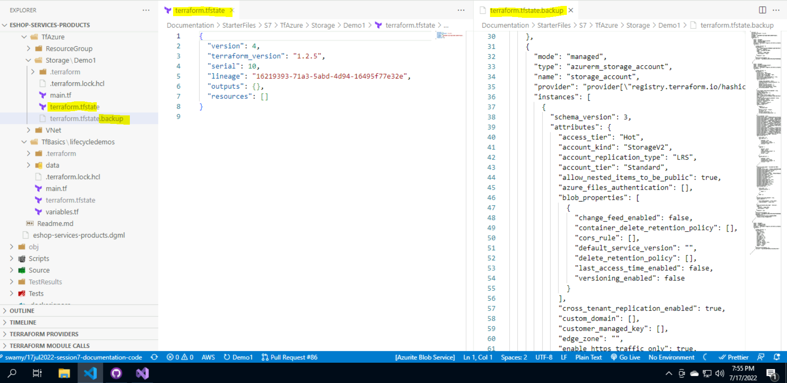
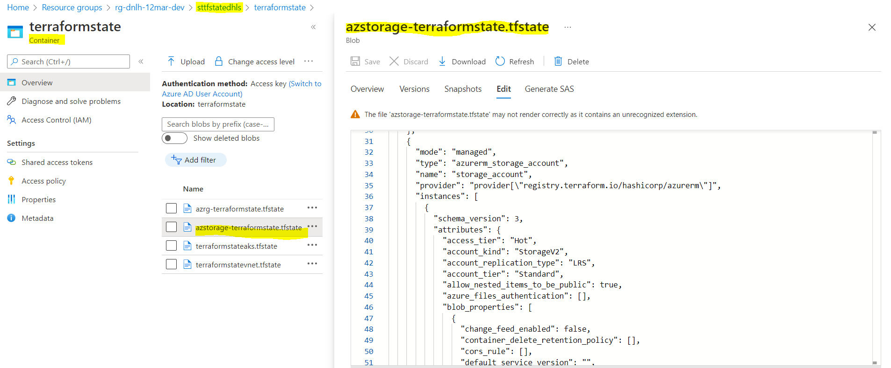
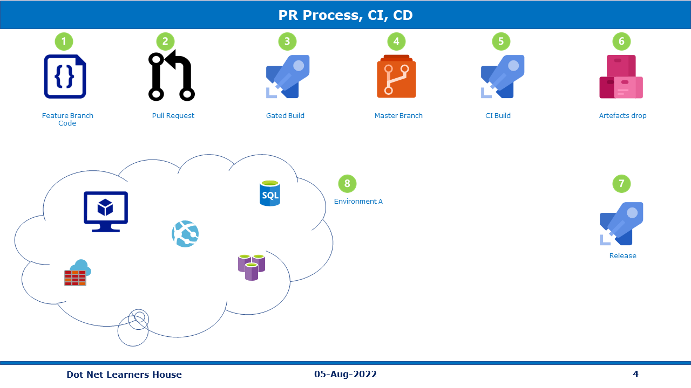

# Session 7

## What are we going to do today?

> 1. Introduction to Terraform (`5 Minutes`)
> 1. Hands-on with local resources using Terraform (main.tf, variables.tf, and output.tf) (`10 Minutes`)
> 1. Terraform State (`5 Minutes`)
> 1. Deploy `Resource Group`, `Virtual Network`, and `Storage Account` to Azure using Terraform (`10 Minutes`)
> 1. DevOps from 30,000 feet (`1 Minutes`)
> 1. Pull Request Process (`5 Minutes`)
> 1. Gated Build, and Continuous Integration Build using `GitHub Actions` for AKS Infrastructure (`5 Minutes`)
> 1. Deploy AKS Infrastructure through Release Pipeline using `GitHub Actions` (`5 Minutes`)
> 1. Review/Q & A/Panel Discussion (`5 Minutes`)
> 1. What is next in `Session 8`? (`5 Minutes`)

## Introduction to Terraform (`5 Minutes`)

> 1. Discussion and Demo
> 1. Private and Public Clouds. HashiCorp Configuration Language (HCL - Declarative Language)

## Hands-on with local resources using Terraform (main.tf, variables.tf, and output.tf) (`10 Minutes`)

> 1. Discussion and Demo
> 1. Providers - Official, Verified, and Community
> 1. Terrafrom Configuration Files OR Terraform Manifest Files
> 1. Blocks | Arguments | Identifiers | Comments | Attributes Reference | Variables | Outputs | Resources | Templates | etc.

```
BlockType Provider_ResourceType ResourceIdentifier
{
   <Identifier> = <Expression> # Arguments
}
```

```
resource "local_file" "hello"{
   filename = "Sample.txt" # Arguments
   content = "Hello World !!" # Arguments
}
```

> 1. Few of the Terraform commands

```terraform
terraform init
terraform validate [-upgrade -reconfigure -migrate-state]
terraform plan (Review the execution plan)
terraform apply
terraform destroy
terraform show
```

**Multiple Providers**


**Variables**


**Attributes and Outputs**


**Resource Dependencies**


## Terraform State (`5 Minutes`)

> 1. Discussion and Demo
> 1. Terraform State - The state file is a file that contains the state of your infrastructure.
> 1. Terraform State - `Local state` file `terraform.tfstate` are stored in the your project directory.
> 1. Terraform State - `Remote state` - Terraform writes the state data to a remote data store (Terraform Cloud, HashiCorp Consul, Amazon S3, Azure Blob Storage, Google Cloud Storage, Alibaba Cloud OSS, and more)
> 1. If you wish to attempt automatic migration of the state, use `"terraform init -migrate-state"`
> 1. If you wish to store the current configuration with no changes to the state, use `"terraform init -reconfigure"`
> 1. `terraform state show local_file.file`

```JSON
  backend "azurerm" {
    resource_group_name  = "resource_group_name"
    storage_account_name = "storage_account_name"
    container_name       = "container_name"
    key                  = "filename.tfstate"
  }
```

**References:**

> 1. [Terraform State - Remote](https://www.terraform.io/language/state/remote)

**Terraform `Local` State**


**Terraform `Remote` State**




## Deploy Resource Group, Virtual Network, and Storage Account to Azure using Terraform (`10 Minutes`)

> 1. Discussion and Demo
> 1. Create Resource Group using Terraform in Azure
> 1. Create Virtual Network using Terraform in Azure
> 1. Create Storage Account using Terraform in Azure

**Create Resource Group using Terraform**


**Network Security Group (NSG), Virtual Network, and Subnet using Terraform**


**Storage Account using Terraform**


## DevOps from 30,000 feet (`1 Minutes`)

> 1. Discussion and Demo

**Reference(s):**

> 1. [Azure DevOps](https://docs.microsoft.com/en-us/azure/devops/user-guide/what-is-azure-devops?view=azure-devops)

## Pull Request Process (`5 Minutes`)

> 1. Discussion and Demo



## Gated Build, and Continuous Integration Build using `GitHub Actions` for AKS Infrastructure (`5 Minutes`)

> 1. Discussion and Demo

**References:**

> 1. [https://docs.github.com/en/actions/using-workflows/reusing-workflows](https://docs.github.com/en/actions/using-workflows/reusing-workflows)
> 1. [https://github.blog/2022-02-10-using-reusable-workflows-github-actions](https://github.blog/2022-02-10-using-reusable-workflows-github-actions)


## Deploy AKS Infrastructure through Release Pipeline using `GitHub Actions` (`5 Minutes`)

> 1. Discussion and Demo


## Review/Q & A/Panel Discussion (`5 Minutes`)

> 1. Discussion

---

## What is next in `Session 8`? (`5 Minutes`) on `19-Aug-2022`

> 1. Deploy `S3 Bucket` to AWS using Terraform (`5 Minutes`)
> 1. Discussion on Infrastructure using Terraform (`5 Minutes`)
> 1. Deploy Products Microservice into AKS (`5 Minutes`)
> 1. Verify the Deployments using Postman (`10 Minutes`)
> 1. Unit Testing (`10 Minutes`)
> 1. Static code Analysis (`10 Minutes`)
> 1. Code Review (`5 Minutes`)
> 1. Software Composition (`5 Minutes`)


