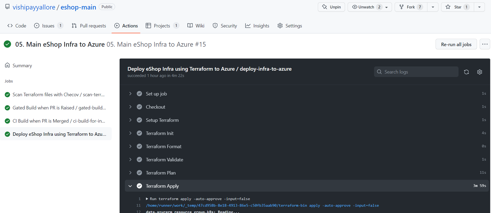
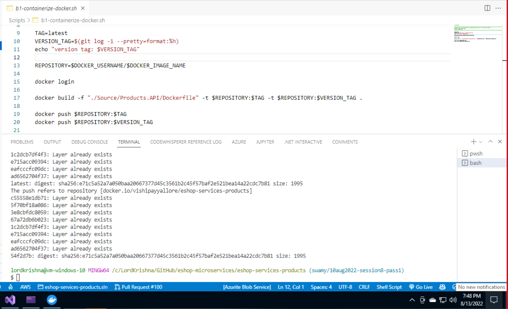
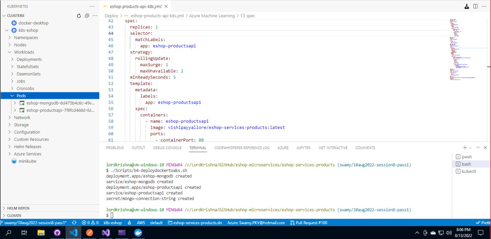

# Session 8

## What are we going to do today?

> 1. Deploy S3 Bucket and Static Web Site to AWS using Terraform (5 Minutes)
> 1. Discussion on AKS Infrastructure Terraform Configuration files (5 Minutes)
> 1. Discussion on GitHub Actions deploying AKS Infrastructure (5 Minutes)
> 1. Create Products.API's docker image and upload it to Docker Hub using Shell Scripts (5 Minutes)
> 1. Deploy Products Microservice docker image into AKS using Shell Scripts (5 Minutes)
> 1. Verify the Deployed Products microservice into AKS using Postman (5 Minutes)
> 1. Unit Testing (5 Minutes)
> 1. Static code Analysis (5 Minutes)
> 1. Software Composition Analysis (5 Minutes)
> 1. Code Review (5 Minutes)
> 1. Review/Q & A/Panel Discussion (5 Minutes)
> 1. What is next in Session 9? (5 Minutes)

## Deploy `S3 Bucket` and Static Web Site to AWS using Terraform (`5 Minutes`)

> 1. Discussion and Demo
> 1. Cloud Agnostic

## Discussion on AKS Infrastructure Terraform Configuration files (`5 Minutes`)

> 1. Discussion and Demo
> 1. Terraform Logs for Debugging
> 1. Terraform State in Azure
> 1. Terraform State in Terraform Cloud

**Terraform Environment Variables**

**Terraform Logs**

**State in Terraform Cloud**

## Discussion on GitHub Actions deploying AKS Infrastructure (`5 Minutes`)

> 1. Discussion and Demo

## Create Products.API's docker image and upload it to `Docker Hub` using Shell Scripts (`5 Minutes`)

> 1. Discussion and Demo

## Deploy Products Microservice docker image into AKS using Shell Scripts (`5 Minutes`)

> 1. Discussion and Demo

## Verify the Deployed `Products` microservice into AKS using Postman (`5 Minutes`)

> 1. Discussion and Demo
> 1. CRUD operations using Postman

## Unit Testing (`5 Minutes`)

> 1. Discussion and Demo
> 1. Test Coverage

## Static code Analysis (`5 Minutes`)

> 1. Discussion and Demo

## Software Composition Analysis (`5 Minutes`)

> 1. Discussion and Demo

**FOSSA SCA**

## Code Review (`5 Minutes`)

> 1. Discussion and Demo

## Review/Q & A/Panel Discussion (`5 Minutes`)

> 1. Discussion

---

## What is next in `Session 9`? (`5 Minutes`) on `09-Sep-2022`

1. Changes to Terraform `configuration files` for Azure Infrastructure (`10 Minutes`) [^1]
1. Deploying AKS and other Infrastructure using GitHub Actions (`5 Minutes`)
1. Create Products.API's `docker image` and upload it to `Docker Hub` using GitHub Actions (`5 Minutes`)
1. Deploy Products Microservice using `docker image` from Docker Hub into `AKS` using GitHub Actions (`5 Minutes`)
1. CRUD Operations on the Deployed `Products` microservice into AKS using Postman (`5 Minutes`)
1. Hands of Azure Kubernetes Infrastructure using Portal / VS Code Extension (`10 Minutes`)
    - Using `Portal`
    - Using `VS Code Extension`
1. Hands of Azure Kubernetes Infrastructure using Imperative way (`10 Minutes`)
    - kubectl get nodes | pods | service | deployments
1. Review/Q & A/Panel Discussion (`5 Minutes`)
1. What is next in `Session 9`? (`5 Minutes`)
