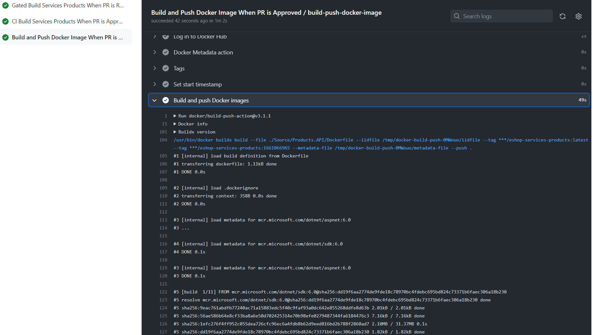

# Session 9

## What are we going to do today?

> 1. Changes to Terraform `configuration files` for Azure Infrastructure (`10 Minutes`) [^1]
> 1. How GitHub Actions gets access on Azure Resources? (`5 Minutes`)
> 1. Deploying Infrastructure to Azure using GitHub Actions (`5 Minutes`)
> 1. Create Products.API's `docker image` and push it to `Docker Hub` using GitHub Actions (`5 Minutes`)
> 1. Deploy Products Microservice `docker image` from Docker Hub into `AKS` using GitHub Actions (`5 Minutes`)
> 1. CRUD Operations on the Deployed `Products` microservice into AKS using Postman (`5 Minutes`)
> 1. Review/Q & A/Panel Discussion (5 Minutes)
> 1. What is next in Session 10? (5 Minutes)

### Notes

[^1] Discuss coupling of Gate/CI/Release Build with Terraform Configuration for Source Code Repository Agnostic Deployment/Pattern

## 1. Changes to Terraform `configuration files` for Azure Infrastructure (`10 Minutes`)

> 1. Discussion and Demo

## 2. How GitHub Actions gets access on Azure Resources? (`5 Minutes`)

> 1. Discussion and Demo

### App Service In Azure

### GitHub Actions Secrets

## 3. Deploying Infrastructure to Azure using GitHub Actions (`5 Minutes`)

> 1. Discussion and Demo

### Graph API Permissions for the Service Pricipal

### Azure Resources creation with Terraform using GitHub Actions

## 4. Create Products.API's `docker image` and push it to `Docker Hub` using GitHub Actions (`5 Minutes`)

> 1. Discussion and Demo
> 1. Build And Push Docker Image To Docker Hub
> 1. Products Micro Service Docker Image Docker Hub

### Build And Push Docker Image To Docker Hub

### Products Micro Service Docker Image Docker Hub

## 5. Deploy Products Microservice `docker image` from Docker Hub into `AKS` using GitHub Actions (`5 Minutes`)

> 1. Discussion and Demo

### Deployment To AKS with Approval

### Deployment To AKS

### Accessing the Products API from AKS

## 6. CRUD Operations on the Deployed `Products` microservice into AKS using Postman (`5 Minutes`)

> 1. Discussion and Demo
> 1. CRUD operations using Postman

### Validating the Products API's Endpoints using Postman

## 7. Review/Q & A/Panel Discussion (`5 Minutes`)

> 1. Discussion

---

## 8. What is next in `Session 10`? (`5 Minutes`) on `09-Sep-2022`

1. Introduction - (5 Minutes)
1. Hands of Azure Kubernetes Infrastructure using Portal / VS Code Extension / Azure Cloud Shell (10 Minutes)
1. Hands of Azure Kubernetes Infrastructure using Imperative way (10 Minutes)
1. Introduction of eShop Main Repo (5 Minutes)
1. PS1/Sh Scripts (5 Minutes)
1. Recap and Review of Products Microservice (10 Minutes)
1. CRUD Operations on the Deployed `Products` microservice into AKS using Postman (5 Minutes)
1. Using Main as the Source of publishing the entire solution (10 Minutes)
1. Review/Q & A/Panel Discussion (`5 Minutes`)
1. What is next in `Session 11`? - (5 Minutes)
