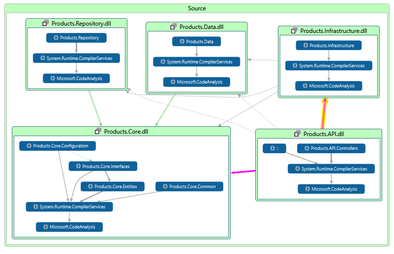
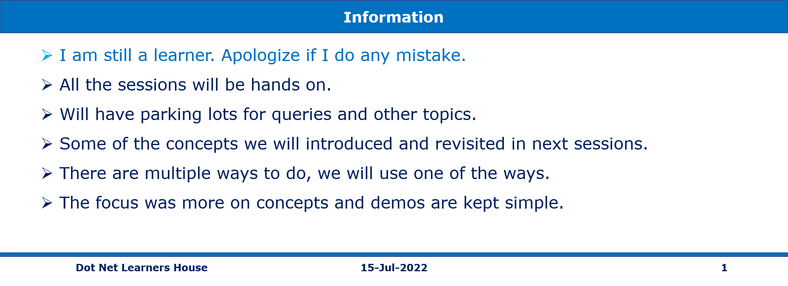
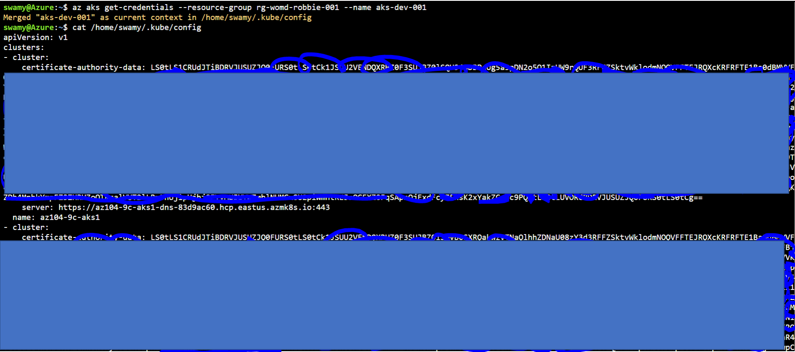
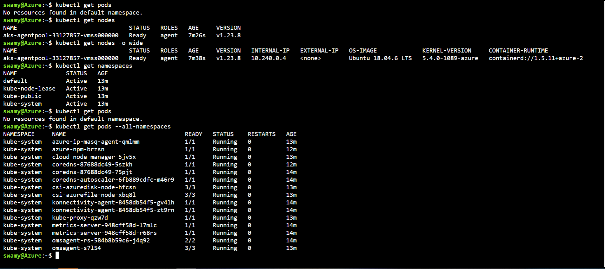
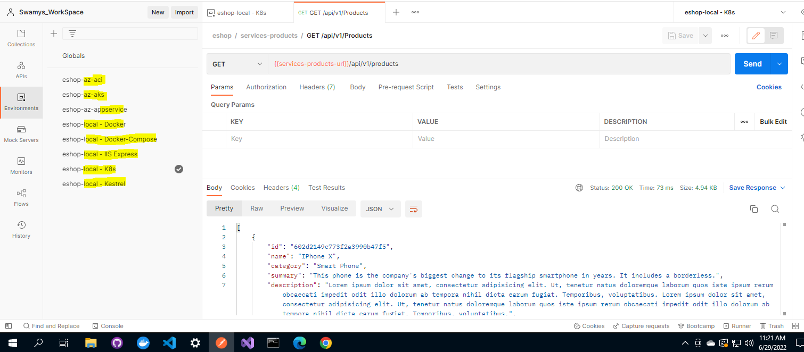

# eShop `Products` Microservice `API`

Description: **`To Be Done`**

## Status Badges

| PR, and CI Builds                                                                                                                                                                                                                  | Code QL                                                                                                                                                                                                                   |
| ---------------------------------------------------------------------------------------------------------------------------------------------------------------------------------------------------------------------------------- | ------------------------------------------------------------------------------------------------------------------------------------------------------------------------------------------------------------------------- |
|  |  |

## Solution Map Diagram

## Pre-Requisites

> 1. Windows 10 / Ubuntu 20.04 / Mac OS 12.3 (build 21E230)
> 1. Visual Studio 2022
> 1. .NET 6
> 1. VS Code (<https://code.visualstudio.com/>)
> 1. Docker Desktop (<https://docs.docker.com/docker-for-windows/install/>)

---

## Links to individual sessions Documentation and its Videos

> 1. Please refer [Session1.md](./Documentation/Sessions/Session1.md) and [Video](https://www.youtube.com/watch?v=wQ0Xf4pKZaQ) for more details.
> 1. Please refer [Session2.md](./Documentation/Sessions/Session2.md) and [Video](https://www.youtube.com/watch?v=R8QIrph-rCI) for more details.
> 1. Please refer [Session3.md](./Documentation/Sessions/Session3.md) and [Video](https://www.youtube.com/watch?v=xst1bjb54JM) for more details.
> 1. Please refer [Session4.md](./Documentation/Sessions/Session4.md) and [Video](https://www.youtube.com/watch?v=G6dPdySKzbs) for more details.
> 1. Please refer [Session5.md](./Documentation/Sessions/Session5.md) and [Video](https://www.youtube.com/watch?v=LPI0VVM24KI) for more details.
> 1. Please refer [Session6.md](./Documentation/Sessions/Session6.md) and [Video](https://www.youtube.com/watch?v=FmMIF6_bGuw) for more details.
> 1. Please refer [Session7.md](./Documentation/Sessions/Session7.md) and [Video](https://www.youtube.com/watch?v=7abmbzh0ckA) for more details.
> 1. Please refer [Session8.md](./Documentation/Sessions/Session8.md) and [Video](https://www.youtube.com/watch?v=z5hxCeCowFM) for more details.
> 1. Please refer [Session9.md](./Documentation/Sessions/Session9.md) and [Video](https://www.youtube.com/watch?v=-aEf272gZBM) for more details.
> 1. Please refer [Session10.md](./Documentation/Sessions/Session10.md) and [Video](https://www.youtube.com/watch?v=9Z4tT84VAr4) for more details.

---

## Session 10

## What are we going to do today?

> 1. Hands on Azure Kubernetes Service using Portal / VS Code Extension  (`10 Minutes`)
>     - Using `Azure Portal` | `VS Code Extension`
> 1. Hands on Azure Kubernetes Service using Imperative way using Azure Cloud Shell (`10 Minutes`)
>     - kubectl get `nodes` | `pods` | `service` | `deployments`
> 1. Introduction of eShop Main GitHub Repository (`5 Minutes`)
> 1. PowerShell/Shell Scripts in 'Main' Repository (`5 Minutes`)
> 1. Recap and Review of Products Microservice (`10 Minutes`)
> 1. CRUD Operations on the Deployed `Products` microservice into AKS using Postman (`5 Minutes`)
> 1. Using Main as the Source of publishing the entire solution (`5 Minutes`)
> 1. Review/Q & A/Panel Discussion (`5 Minutes`)
> 1. What is next in `Session 11`? (`5 Minutes`)

## 1. Hands on Azure Kubernetes Service using Portal / VS Code Extension (`10 Minutes`)

> 1. Discussion and Demo

### Using `Azure Portal` | `VS Code Extension`

> 1. Discussion and Demo

## 2. Hands on Azure Kubernetes Service using Imperative way using Azure Cloud Shell (`10 Minutes`)

> 1. Discussion and Demo

### kubectl get `nodes` | `pods` | `service` | `deployments`

> 1. Discussion and Demo

### Using `Azure Cloud Shell`

> 1. Discussion and Demo

## 3. Introduction of eShop Main GitHub Repository (`5 Minutes`)

> 1. Discussion

## 4. PowerShell/Shell Scripts in 'Main' Repository (`5 Minutes`)

> 1. Discussion and Demo

## 5. Recap and Review of Products Microservice (`10 Minutes`)

> 1. Discussion

## 6. CRUD Operations on the Deployed `Products` microservice into AKS using Postman (`5 Minutes`)

> 1. Discussion and Demo

## 7. Using Main as the Source of publishing the entire solution (`5 Minutes`)

> 1. Discussion

## 8. Review/Q & A/Panel Discussion (`5 Minutes`)

> 1. Discussion

## 9. What is next in `Session 11`? (`5 Minutes`) on `4-Nov-2022`

> 1. Introduction to `eShop` Client Application Angular 14
> 1. eShop Client Integrating with Products Micro Services WITHOUT Authentication
> 1. List of Products ONLY
> 1. Review/Q & A/Panel Discussion (`5 Minutes`)
> 1. What is next in `Session 11`? (`5 Minutes`)

---

## `****************** WISH LIST ******************`

## New Features

> 1. Using Record for Product Dto
> 1. Using ResponseDto for sending Unified Response
> 1. Model Validations
> 1. Health Checks
> 1. Versioning
> 1. Paging, Filtering, Sorting, and Searching

## Registries

> 1. Azure Container Registry
> 1. GitHub Registry

## DevOps

> 1. CI/CD with Azure DevOps/GitHub Actions

## Deployments

> 1. Deployment into K8s using Docker Image
> 1. Deployment into K8s using ACR
> 1. Deployment into Container Apps
> 1. Kubernetes Service Mesh

## Alerts and Monitoring

> 1. Prometheus
> 1. Grafana

## Security

> 1. Static Analysis
> 1. Vulnerability Scanning
> 1. Supply Chain Security
> 1. Software Composition
> 1. Use Network Security Policies to Restrict Cluster Level Access
> 1. Cluster Hardening - RBAC
> 1. Properly Set Up Ingress Objects with Security Control
> 1. Protect Node Metadata and Endpoints

## Testing

> 1. Unit Testing
> 1. Integration Testing
> 1. Performance Testing

---

## Verify the Deployments using Postman (`10 Minutes`)

> 1. Discussion and Demo

### Verify the end points `locally` (Kestrel, IIS Express, Docker, Docker-Compose, and K8s)

> 1. Discussion and Demo

### Verify the end points from `Azure Container Instances`

> 1. Discussion and Demo

### Verify the end points `Docker Instances from App Service`

> 1. Discussion and Demo

### Verify the end points `Azure Kubernetes Service`

> 1. Discussion and Demo

