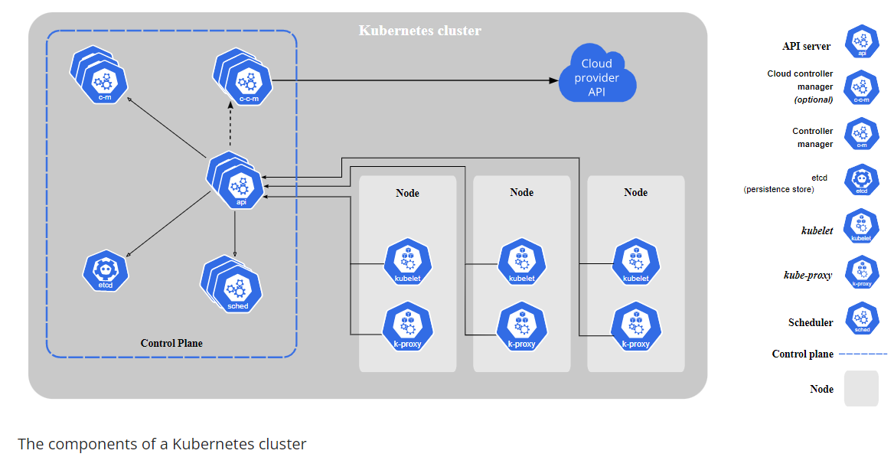
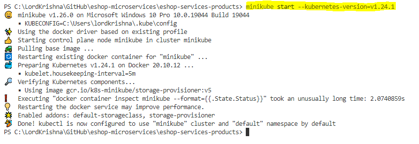
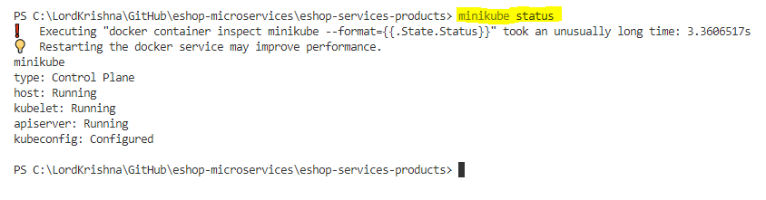
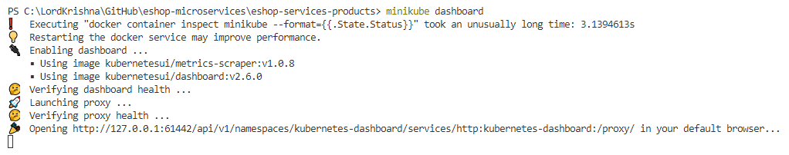
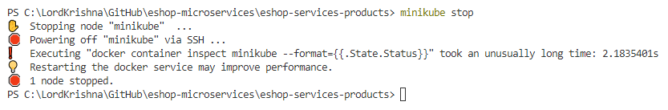
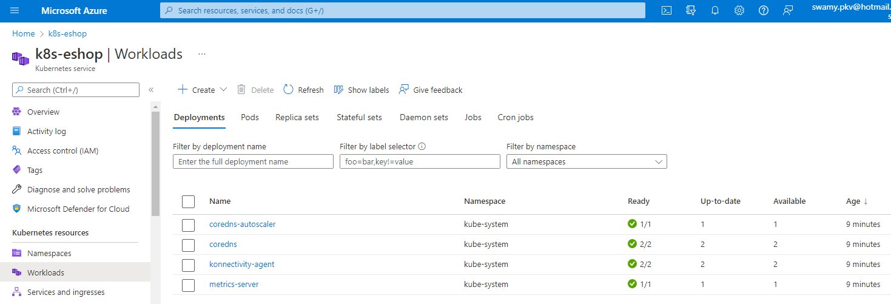
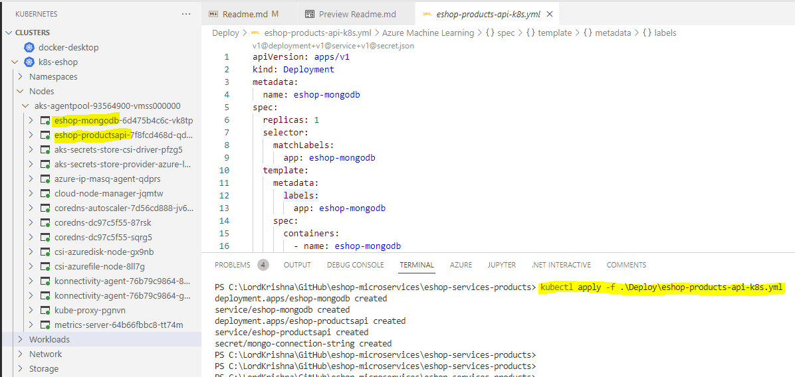
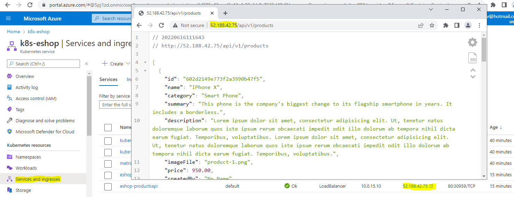

# eShop `Products` Microservice `API`

Description: To Be Done

## Status Badges

| PR, and CI Builds                                                                                                                                                                                                                  | Code QL                                                                                                                                                                                                                   |
| ---------------------------------------------------------------------------------------------------------------------------------------------------------------------------------------------------------------------------------- | ------------------------------------------------------------------------------------------------------------------------------------------------------------------------------------------------------------------------- |
| [](https://github.com/vishipayyallore/eshop-services-products/actions/workflows/Products-Api-CI.yml) | [](https://github.com/vishipayyallore/eshop-services-products/actions/workflows/codeql-analysis.yml) |

## Solution Map Diagram


## Pre-Requisites

> 1. Windows 10 / Ubuntu 20.04 / Mac OS 12.3 (build 21E230)
> 1. Visual Studio 2022
> 1. .NET 6
> 1. VS Code (https://code.visualstudio.com/)
> 1. Docker Desktop (https://docs.docker.com/docker-for-windows/install/)

---

## Links to Documentation

> 1. Please refer [Session1.md](./Documentation/Sessions/Session1.md) for more details.
> 1. Please refer Session 1's [Video](https://www.youtube.com/watch?v=wQ0Xf4pKZaQ) for more details.
> 1. Please refer [Session2.md](./Documentation/Sessions/Session2.md) for more details.
> 1. Please refer Session 2's [Video](https://www.youtube.com/watch?v=R8QIrph-rCI) for more details.
> 1. Please refer [Session3.md](./Documentation/Sessions/Session3.md) for more details.
> 1. Please refer Session 3's [Video](https://www.youtube.com/watch?v=xst1bjb54JM) for more details.
> 1. Please refer [Session4.md](./Documentation/Sessions/Session4.md) for more details.
> 1. Please refer Session 4's [Video](https://www.youtube.com/watch?v=G6dPdySKzbs) for more details.

---

## Session 5

## Introduction to K8s. What and Why of K8s (`5 Minutes`)

> 1. Demo and Discussion
> 1. K8s container runtime agnostic
> 1. [DC/OS](https://dcos.io/), [Kubernetes](https://kubernetes.io/docs/home/), and [Docker Swarm](https://docs.docker.com/engine/swarm/)
> 1. AKS, EKS, and GKE

---

## Hands on K8s & Hands on Minikube locally (`30 Minutes`)

> 1. Demo and Discussion

**Reference:** [K8s Components](https://kubernetes.io/docs/concepts/overview/components/)


**Image:** From Official K8s Documentation

### Single Node K8s Cluster

> 1. Docker Desktop, minikube, and kubeadm (Linux Machines)

### Multi Node K8s Cluster

> 1. AKS, EKS, GKE, kubespray/kubeadm (Full Control)

### K8s Terms

> 1. Clusters
> 1. Nodes (Master, and Worker)
> 1. Namespace
> 1. Pods (One or more containers)
> 1. Service
> 1. Deployment
> 1. Replica Set

### Minikube

> 1. Demo and Discussion
> 1. Install Minikube
> 1. Start Minikube
> 1. Stop Minikube
> 1. Minikube dashboard and Accessing the **Minikube** dashboard

```
minikube start --kubernetes-version=v1.24.1
```



```
minikube status
```



```
minikube dashboard
```



```
minikube stop
```



### K8s CLI (kubectl)

> 1. Demo and Discussion

### Deploying `Multi Containers` in **Minikube** using **YML**

> 1. Demo and Discussion
> 1. Port Forwarding
> 1. Accessing the Products API

---

## Deploying `Multi Containers` in **AKS** using **YML** (`10 Minutes`)

**Note:**
Kubernetes and YAML files will be discussed in the next session.

> 1. Kubernetes Cluster has been deployed using Github Actions
> 1. Please refer [eshop-products-api-k8s.yml](./Deploy/eshop-products-api-k8s.yml) file
> 1. Deployment of Products API Micro Service Multi Containers using `kubectl apply -f` command
> 1. Accessing the Products API from AKS Multi Containers

**Kubernetes Cluster has been deployed using Github Actions**


**Deployment of Products API Micro Service Multi Containers in K8s**


**Accessing the Products API from AKS Multi Containers**


---

## Verify the Deployments using Postman (`10 Minutes`)

> 1. Demo and Discussion

### Verify the end points `locally` (Kestrel, IIS Express, Docker, Docker-Compose, and K8s)

> 1. Demo and Discussion

### Verify the end points from `Azure Container Instances`

> 1. Demo and Discussion

### Verify the end points `Docker Instances from App Service`

> 1. Demo and Discussion

### Verify the end points `Azure Kubernetes Service`

> 1. Demo and Discussion

## Review/Q & A/Panel Discussion

> 1. Discussion

## What is next in `Session 6`?

> 1. Discussion

---

## Session 6

## New Features (`10 Minutes`)

> 1. Using Record for Product Dto
> 1. Using ResponseDto for sending Unified Response

### Using Record for Product Dto

> 1. Demo and Discussion

### Using ResponseDto for sending Unified Response

> 1. Demo and Discussion

---

## IaC using Terraform (`15 Minutes`)

> 1. Demo and Discussion

---

## Deployment into Container Apps (`15 Minutes`)

> 1. Demo and Discussion

---

## Deployment into K8s using Docker Image (`5 Minutes`)

> 1. Demo and Discussion

## Deployment into K8s using ACR (`5 Minutes`)

---

## Verify the Deployments using Postman (`10 Minutes`)

> 1. Demo and Discussion

### Verify the end points `locally` (Kestrel, IIS Express, Docker, Docker-Compose, and K8s)

> 1. Demo and Discussion

### Verify the end points from `Azure Container Instances`

> 1. Demo and Discussion

### Verify the end points `Docker Instances from App Service`

> 1. Demo and Discussion

### Verify the end points `Azure Kubernetes Service`

> 1. Demo and Discussion

## Review/Q & A/Panel Discussion

> 1. Discussion

## What is next in `Session 7`?

> 1. Discussion

---

## Session 7

---

---

## New Features

> 1. Model Validations

## New Features

> 1. Health Checks
> 1. Versioning
> 1. Unit Testing
> 1. Paging, Filtering, Sorting, and Searching

## Deployment

> 1. GitHub Registry

### Kubernetes

> 1. Azure Container Registry
> 1. Azure Kubernetes Service

## CI with GitHub Actions

> 1. Products-Api-CI

[](https://github.com/vishipayyallore/eshop-services-products/actions/workflows/Products-Api-CI.yml)

## CD with GitHub Actions

> 1. To Be Done

---

## Session 8

---

## New Features

> 1. IaC with ARM/Bicep/Terraform
> 1. CI/CD with Azure DevOps/GitHub Actions

## Deployment

### Service Mesh

> 1. Azure Container Registry
> 1. Kubernetes Service Mesh
