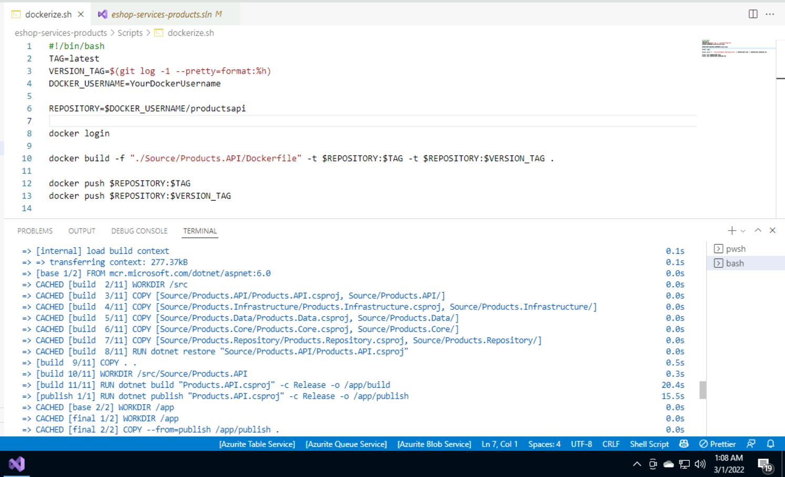
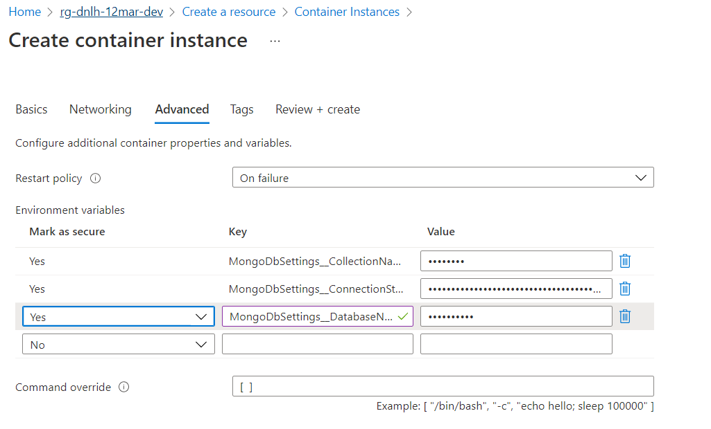
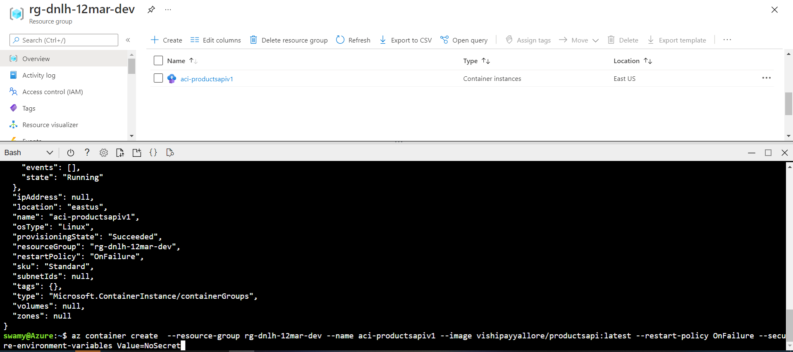
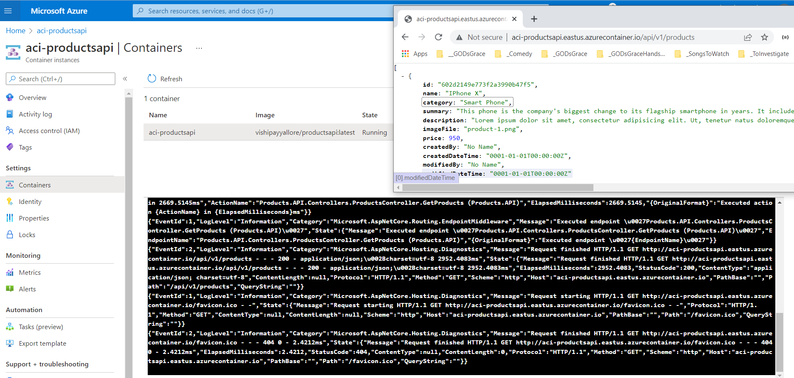

# eshop `Products` Microservice `API`

Description: To Be Done

## Build Status

[](https://github.com/vishipayyallore/eshop-services-products/actions/workflows/Products-Api-CI.yml)

## Solution Map Diagram


## Pre-Requisites

> 1. Windows 10
> 1. Visual Studio 2022
> 1. .NET 6
> 1. VS Code (https://code.visualstudio.com/)
> 1. Docker Desktop (https://docs.docker.com/docker-for-windows/install/)

## Individual Microservice Architecture

To Be Done

## Solution Architecture

To Be Done

---

## Session 1

---

## Docker Desktop

> 1. Demo and Discussion

## Mongo Db

> 1. Mongo Atlas
> 1. MongoDB Community Edition
> 1. MongoDB Docker Container
> 1. Mongo GUI Docker Container

## Current Features in Web API

> 1. Layered Architecture
> 1. Strongly typed Configuration
> 1. Swagger
> 1. Repository Pattern
> 1. Dependency Injection (Demo)

## Dockerfile

> 1. Demo and Discussion

## Docker Compose

> 1. Demo and Discussion
> 1. Docker-Compose.yml
> 1. Docker-Compose.override.yml

## Local Execution Modes using VS 2022

**Note:** Mongo Db in Atlas and Docker Container

> 1. IIS Express
> 1. Kestrel
> 1. Docker
> 1. Docker Compose


## Local Execution using VS Code

> 1. Demo and Discussion

## Shell Scripts

> 1. Demo and Discussion

---

## Session 2

---

## New Features

> 1. Serilog
> 1. Postman Collection

## Executing the solution in Ubuntu 20.04 / Mac OS (???)

> 1. Discussion and Demo

## Build And Push Image To Docker Hub



## Deployment

### Single Container using Azure **`Container Instances`**

```
MongoDbSettings__CollectionName = Products
MongoDbSettings__ConnectionString = mongodb://productsdb:27017
MongoDbSettings__DatabaseName = ProductsDb
```

**Using Azure Portal**


**Using Azure CLI**


**Accessing the API from ACI Container**


### `Multi Containers` in **Container Instances** using **Container Group**

> 1. To Be Done

---

## Session 3

---

## New Features

> 1. Model Validations
> 1. DTO
> 1. Auto Mapper
> 1. Health Checks

## Deployment

### `Multi Containers` in **App Service** using **Docker Compose**

```
version: '3.4'

services:
  productsdb:
    image: mongo
    container_name: productsdb
    restart: always
    ports:
      - "27017:27017"
    volumes:
      - mongo_data:/data/db

  products.api:
    image: vishipayyallore/productsapi:latest
    container_name: products.api
    environment:
      - "MongoDbSettings__ConnectionString=mongodb://productsdb:27017"
    depends_on:
      - productsdb
    ports:
      - "8000:80"
    volumes:
      - ${APPDATA}/ASP.NET/Https:/root/.aspnet/https:ro

volumes:
  mongo_data:
```

**AppSettings** Under **Configuration** of App Service

```
MongoDbSettings_CollectionName = Products
MongoDbSettings_ConnectionString = mongodb://productsdb:27017
MongoDbSettings_DatabaseName = ProductsDb
```


---

## Session 4

---

## New Features

> 1. Paging, Filtering, Sorting, and Searching
> 1. Versioning

## CI with GitHub Actions

> 1. Products-Api-CI

[](https://github.com/vishipayyallore/eshop-services-products/actions/workflows/Products-Api-CI.yml)

## CD with GitHub Actions

> 1. To Be Done

## Deployment

### Container Apps

> 1. GitHub Registry
> 1. Azure Container Apps

---

## Session 5

---

## New Features

> 1. Unit Testing

## Deployment

### Kubernetes

> 1. Azure Container Registry
> 1. Azure Kubernetes Service

---

## Session 6

---

## New Features

> 1. IaC with ARM/Bicep/Terraform
> 1. CI/CD with Azure DevOps/GitHub Actions

## Deployment

### Service Mesh

> 1. Azure Container Registry
> 1. Kubernetes Service Mesh
