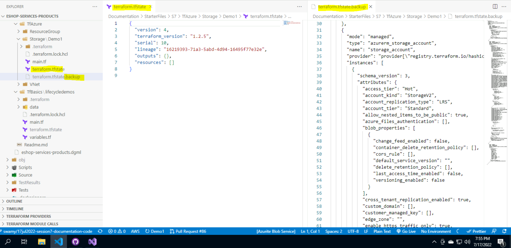
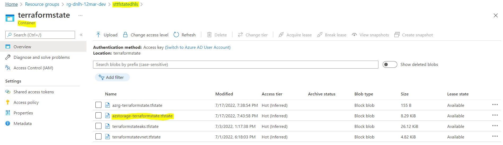
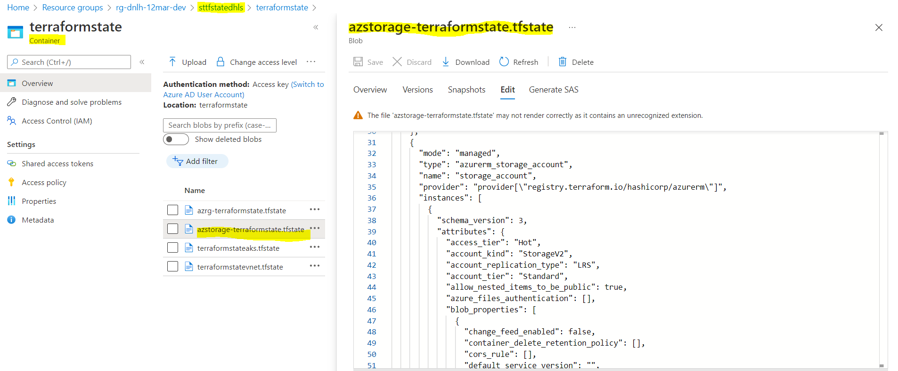
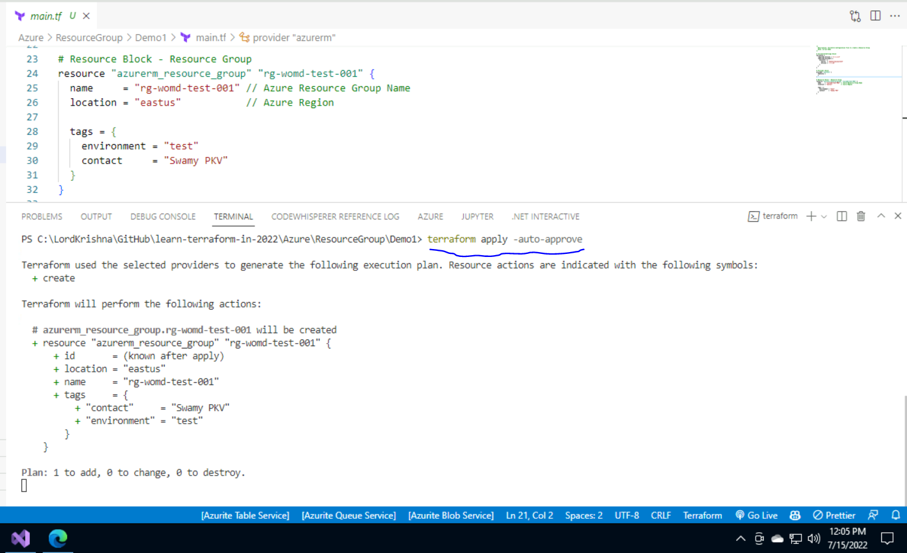
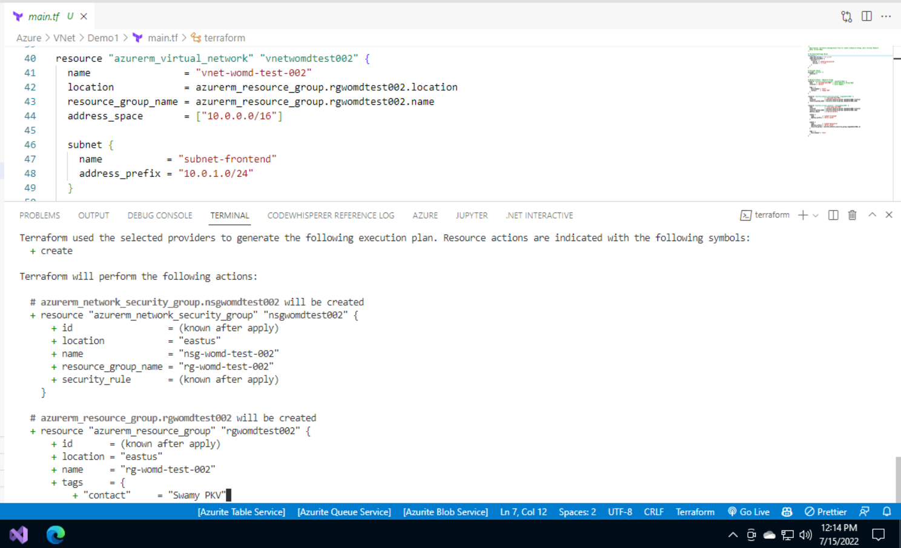
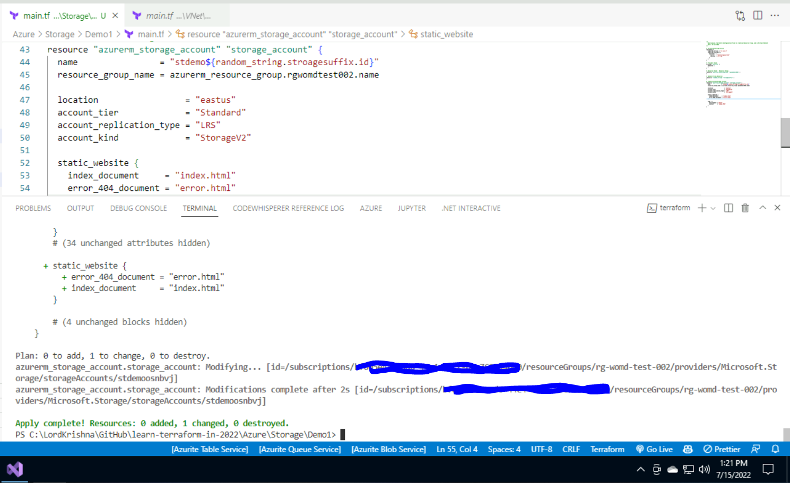
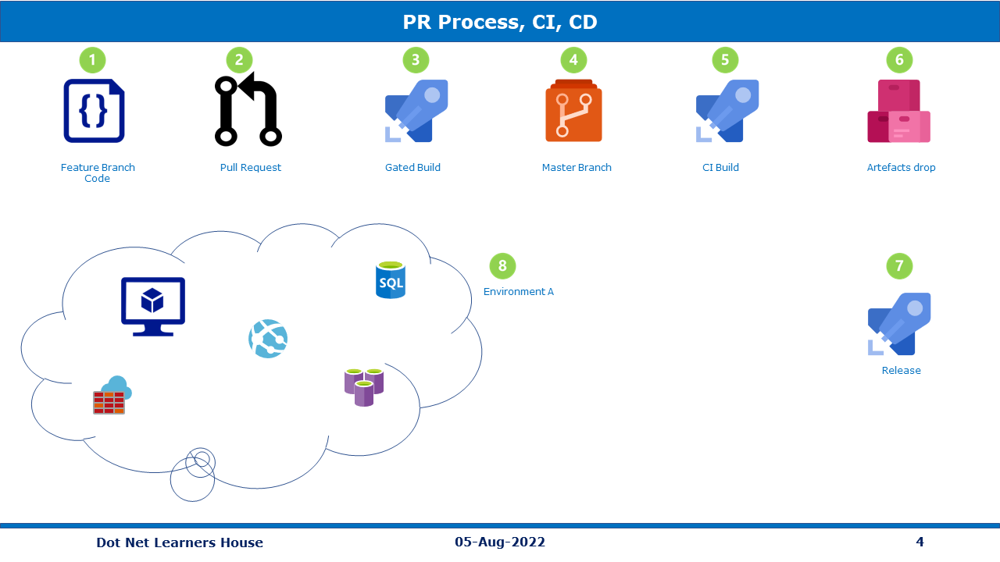

# eShop `Products` Microservice `API`

Description: **`To Be Done`**

## Status Badges

| PR, and CI Builds                                                                                                                                                                                                                  | Code QL                                                                                                                                                                                                                   |
| ---------------------------------------------------------------------------------------------------------------------------------------------------------------------------------------------------------------------------------- | ------------------------------------------------------------------------------------------------------------------------------------------------------------------------------------------------------------------------- |
| [](https://github.com/vishipayyallore/eshop-services-products/actions/workflows/Products-Api-CI.yml) | [](https://github.com/vishipayyallore/eshop-services-products/actions/workflows/codeql-analysis.yml) |

## Solution Map Diagram


## Pre-Requisites

> 1. Windows 10 / Ubuntu 20.04 / Mac OS 12.3 (build 21E230)
> 1. Visual Studio 2022
> 1. .NET 6
> 1. VS Code (https://code.visualstudio.com/)
> 1. Docker Desktop (https://docs.docker.com/docker-for-windows/install/)

---

## Links to individual sessions Documentation and its Videos

> 1. Please refer [Session1.md](./Documentation/Sessions/Session1.md) and [Video](https://www.youtube.com/watch?v=wQ0Xf4pKZaQ)for more details.
> 1. Please refer [Session2.md](./Documentation/Sessions/Session2.md) and [Video](https://www.youtube.com/watch?v=R8QIrph-rCI) for more details.
> 1. Please refer [Session3.md](./Documentation/Sessions/Session3.md) and [Video](https://www.youtube.com/watch?v=xst1bjb54JM) for more details.
> 1. Please refer [Session4.md](./Documentation/Sessions/Session4.md) and [Video](https://www.youtube.com/watch?v=G6dPdySKzbs) for more details.
> 1. Please refer [Session5.md](./Documentation/Sessions/Session5.md) and [Video](https://www.youtube.com/watch?v=LPI0VVM24KI) for more details.
> 1. Please refer [Session6.md](./Documentation/Sessions/Session6.md) and [Video](https://www.youtube.com/watch?v=FmMIF6_bGuw) for more details.

---

## Session 7

## What are we going to do today?

> 1. Introduction to Terraform (`5 Minutes`)
> 1. Hands-on with local resources using Terraform (main.tf, variables.tf, and output.tf) (`10 Minutes`)
> 1. Terraform State (`5 Minutes`)
> 1. Deploy `Resource Group`, `Virtual Network`, and `Storage Account` to Azure using Terraform (`10 Minutes`)
> 1. DevOps from 30,000 feet (`1 Minutes`)
> 1. Pull Request Process (`5 Minutes`)
> 1. Infrastructure AKS - Gated Build, and Continuous Integration Build using `GitHub Actions` (`5 Minutes`)
> 1. Infrastructure AKS - Release Pipeline using `GitHub Actions` (`5 Minutes`)
> 1. Deploy Products Microservice into AKS (`5 Minutes`) - **Stretch Goal**
> 1. Deploy `S3 Bucket` to AWS using Terraform (`5 Minutes`) - **Stretch Goal**
> 1. Review/Q & A/Panel Discussion (`5 Minutes`)
> 1. What is next in `Session 8`? (`5 Minutes`)


## Introduction to Terraform (`5 Minutes`)

> 1. Discussion and Demo
> 1. Private and Public Clouds. HashiCorp Configuration Language (HCL - Declarative Language)

## Hands-on with local resources using Terraform (main.tf, variables.tf, and output.tf) (`10 Minutes`)

> 1. Discussion and Demo
> 1. Providers - Official, Verified, and Community
> 1. Terrafrom Configuration Files OR Terraform Manifest Files
> 1. Blocks | Arguments | Identifiers | Comments | Attributes Reference | Variables | Outputs | Resources | Templates | etc.

```
BlockType Provider_ResourceType ResourceName
{
   <Identifier> = <Expression> # Arguments
}
```

```
resource "local_file" "hello"{
   filename = "Sample.txt" # Arguments
   content = "Hello World !!" # Arguments
}
```

> 1. Few of the Terraform commands

```terraform
terraform init
terraform validate
terraform plan (Review the execution plan)
terraform apply
terraform destroy
terraform show
```

## Terraform State (`5 Minutes`)

> 1. Discussion and Demo
> 1. Terraform State - The state file is a file that contains the state of your infrastructure.
> 1. Terraform State - `Local state` file `terraform.tfstate` are stored in the your project directory.
> 1. Terraform State - `Remote state` - Terraform writes the state data to a remote data store (Terraform Cloud, HashiCorp Consul, Amazon S3, Azure Blob Storage, Google Cloud Storage, Alibaba Cloud OSS, and more)
> 1. If you wish to attempt automatic migration of the state, use `"terraform init -migrate-state"`
> 1. If you wish to store the current configuration with no changes to the state, use `"terraform init -reconfigure"`

**References:**

> 1. [Terraform State - Remote](https://www.terraform.io/language/state/remote)

**Terraform `Local` State**


**Terraform `Remote` State**




## Deploy Resource Group, Virtual Network, and Storage Account to Azure using Terraform (`10 Minutes`)

> 1. Discussion and Demo
> 1. Create Resource Group using Terraform in Azure
> 1. Create Virtual Network using Terraform in Azure
> 1. Create Storage Account using Terraform in Azure

**Create Resource Group using Terraform**


**Network Security Group (NSG), Virtual Network, and Subnet using Terraform**


**Storage Account using Terraform**


## DevOps from 30,000 feet (`1 Minutes`)

> 1. Discussion and Demo

**Reference(s):**

> 1. [Azure DevOps](https://docs.microsoft.com/en-us/azure/devops/user-guide/what-is-azure-devops?view=azure-devops)

## Pull Request Process (`5 Minutes`)

> 1. Discussion and Demo



## Infrastructure AKS - Gated Build, and Continuous Integration Build using `GitHub Actions` (`5 Minutes`)

> 1. Discussion and Demo

## Deploy AKS Infrastructure - Release Pipeline using `GitHub Actions` (`5 Minutes`)

> 1. Discussion and Demo

## Deploy Products Microservice into AKS (`5 Minutes`) - **Stretch Goal**

> 1. Discussion and Demo

## Deploy `S3 Bucket` to AWS using Terraform (`5 Minutes`) - **Stretch Goal**

> 1. Discussion and Demo

## Review/Q & A/Panel Discussion (`5 Minutes`)

> 1. Discussion

## What is next in `Session 7`? (`5 Minutes`)

> 1. Discussion

---

## `**Wish List**`

## New Features

> 1. Using Record for Product Dto
> 1. Using ResponseDto for sending Unified Response
> 1. Model Validations
> 1. Health Checks
> 1. Versioning
> 1. Paging, Filtering, Sorting, and Searching

## Registries

> 1. Azure Container Registry
> 1. GitHub Registry

## DevOps

> 1. CI/CD with Azure DevOps/GitHub Actions

## Deployments

> 1. Deployment into K8s using Docker Image
> 1. Deployment into K8s using ACR
> 1. Deployment into Container Apps
> 1. Kubernetes Service Mesh

## Alerts and Monitoring

> 1. Prometheus
> 1. Grafana

## Security

> 1. Static Analysis
> 1. Vulnerability Scanning
> 1. Supply Chain Security
> 1. Software Composition
> 1. Use Network Security Policies to Restrict Cluster Level Access
> 1. Cluster Hardening - RBAC
> 1. Properly Set Up Ingress Objects with Security Control
> 1. Protect Node Metadata and Endpoints

## Testing

> 1. Unit Testing
> 1. Integration Testing
> 1. Performance Testing

---

## Verify the Deployments using Postman (`10 Minutes`)

> 1. Discussion and Demo

### Verify the end points `locally` (Kestrel, IIS Express, Docker, Docker-Compose, and K8s)

> 1. Discussion and Demo

### Verify the end points from `Azure Container Instances`

> 1. Discussion and Demo

### Verify the end points `Docker Instances from App Service`

> 1. Discussion and Demo

### Verify the end points `Azure Kubernetes Service`

> 1. Discussion and Demo


