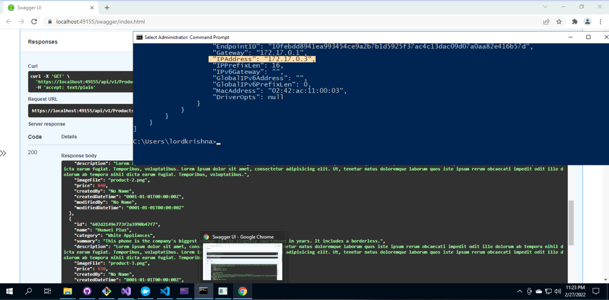

# eshop-services-products

eshop Product Micro Service

## Solution Map Diagram

## Current Features

> 1. Layered Architecture
> 1. Strongly typed Configuration
> 1. Swagger
> 1. Repository Pattern
> 1. Dependency Injection

## Local Execution Modes

> 1. IIS Express
> 1. Kestrel
> 1. Docker
> 1. Docker Compose

## Deployment

> 1. Docker Hub
> 1. Azure Container Instances

## To Do List

> 1. Serilog
> 1. DTO
> 1. Auto Mapper
> 1. Paging, Filtering, Sorting
> 1. Versioning
> 1. Unit Testing
> 1. IaC with ARM/Bicep/Terraform
> 1. CI/CD with Azure DevOps/GitHub Actions

## Future Deployment Models

> 1. GitHub Registry
> 1. Azure Container Apps

> 1. Azure Container Registry
> 1. Azure Kubernetes Service
