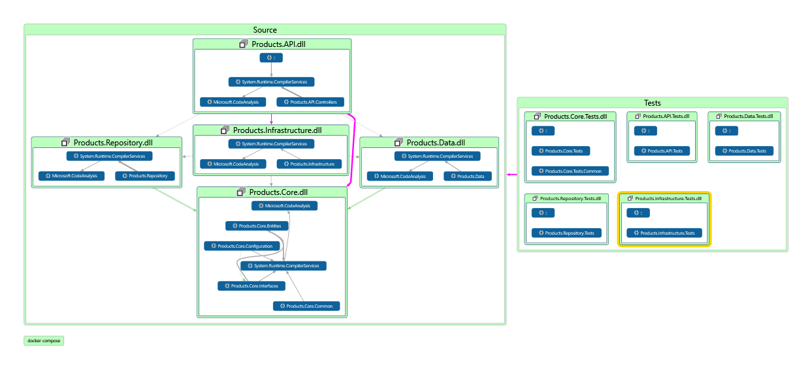

# eshop-services-products
eshop Product Micro Service

## Solution Map Diagram

## Current Features
> 1. Layered Architecture
> 1. Strongly typed Configuration

## Current Features
> 1. Layered Architecture
> 1. Strongly typed Configuration

## Deployment
> 1. Docker Hub / Azure Container Registry / GitHub Registry
> 1. Azure Container Instances
> 1. Azure Container Apps
> 1. Azure Kubernetes Service

## To Do List

> 1. Serilog
> 1. DTO
> 1. Auto Mapper
> 1. Paging, Filtering, Sorting
> 1. Versioning
