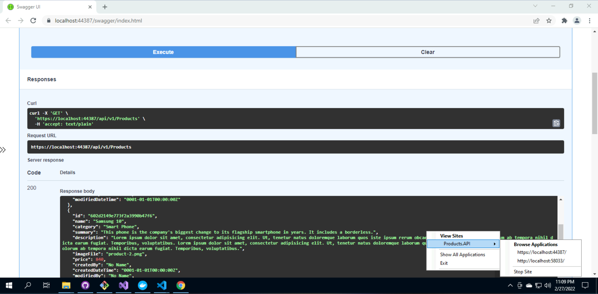

# eshop-services-products

eshop Product Micro Service

## Solution Map Diagram


## Current Features

> 1. Layered Architecture
> 1. Strongly typed Configuration
> 1. Swagger
> 1. Repository Pattern
> 1. Dependency Injection

## Local Execution Modes

> 1. IIS Express
> 1. Kestrel
> 1. Docker
> 1. Docker Compose




## Build And Push Image To Docker Hub


## Deployment

Multi Containers in **App Service** using **Docker Compose**

```
version: '3.4'

services:
  productsdb:
    image: mongo
    container_name: productsdb
    restart: always
    ports:
      - "27017:27017"
    volumes:
      - mongo_data:/data/db

  products.api:
    image: vishipayyallore/productsapi:latest
    container_name: products.api
    environment:
      - "MongoDbSettings__ConnectionString=mongodb://productsdb:27017"
    depends_on:
      - productsdb
    ports:
      - "8000:80"
    volumes:
      - ${APPDATA}/ASP.NET/Https:/root/.aspnet/https:ro

volumes:
  mongo_data:
```


## To Do List

> 1. Serilog
> 1. DTO
> 1. Auto Mapper
> 1. Model Validations
> 1. Paging, Filtering, Sorting, and Searching
> 1. Versioning
> 1. Unit Testing
> 1. IaC with ARM/Bicep/Terraform
> 1. CI/CD with Azure DevOps/GitHub Actions

## Future Deployment Models

**Container Apps**

> 1. GitHub Registry
> 1. Azure Container Apps

**Kubernetes**

> 1. Azure Container Registry
> 1. Azure Kubernetes Service

**Service Mesh**

> 1. Azure Container Registry
> 1. Kubernetes Service Mesh
